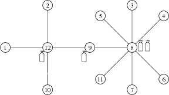

## 문제

Byteasar는 새로운 궁전을 지었다. 그 궁전은 N개의 방과 N-1개의 통로가 방을 잇고 있다. 각각의 통로는 정확히 두 개의 방을 연결한다. 방은 1부터 N까지 번호를 가지며, 궁전으로 가는 유일한 입구는 1번 방이다. 모든 방은 입구에서부터의 경로가 유일하다. 즉, 방들은 트리 구조를 이루고 있다.

이 궁전의 소방국장은 건물 내부에 소화기를 배치하려 한다. 그는 다음의 규칙대로 소화기를 배치할 것이다.

* 소화기는 방 안에 배치되어야 하며, 하나의 방은 소화기를 몇 개라도 가질 수 있다.
* 하나의 소화기는 그 소화기가 위치한 방에서 K개의 통로 이내에 떨어져 있는 방까지 지킬 수 있다. 이를 소화기의 '영역'이라 하자.
* 각각의 방은 하나 이상의 소화기의 영역에 들어야 한다.
* 각 소화기는 최대 S개의 방을 영역으로 가질 수 있다.

Byteasar는 궁전을 짓느라 국고 대부분을 탕진한 상태다. 따라서 그는 궁전의 모든 방을 화재의 위험에서 벗어나도록 하는 소화기의 배치 중 최소 개수의 소화기가 배치되기를 원한다. Byteasar를 도와주자!

## 입력

표준 입력의 첫 줄은 N, S, K가 공백을 두고 입력된다. (1 ≤ N ≤ 100,000, 1 ≤ S ≤ N, 1 ≤ K ≤ 20) 다음으로 N-1줄 동안 두 개의 정수가 공백을 두고 입력된다. i+1번째 줄은 xi와 yi를 입력받는데, 이는 xi와 yi를 연결하는 간선이라는 뜻이다.

## 출력

필요한 최소 개수의 소화기를 출력하여라.

## 힌트

