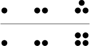

## 문제

Johny and Margaret are playing "pebbles". Initially there is a certain number of pebbles on a table, grouped in n piles. The piles are next to each other, forming a single row. The arrangement of stones satisfies an additional property that each pile consists of at least as many pebbles as the one to the left (with the obvious exception of the leftmost pile). The players alternately remove any number of pebbles from a single pile of their choice. They have to take care, though, not to make any pile smaller than the one left to it. In other words, the piles have to satisfy the initial property after the move as well. When one of the players cannot make a move (i.e. before his move there are no more pebbles on the table), he loses. Johny always starts, to compensate for Margaret's mastery in this game.

In fact Margaret is so good that she always makes the best move, and wins the game whenever she has a chance. Therefore Johny asks your help - he would like to know if he stands a chance of beating Margaret with a particular initial arrangement. Write a programme that determines answers to Johny's inquiries.

## 입력

In the first line of the standard input there is a single integer u (1 ≤ u ≤ 10) denoting the number of initial pebble arrangements to analyse. The following 2u lines contain descriptions of these arrangements; each one takes exactly two lines.

The first line of each description contains a single integer n, 1 ≤ n ≤ 1,000  - the number of piles. The second line of description holds n non-negative integers ai separated by single spaces and denoting the numbers of pebbles in successive piles, left to right. These numbers satisfy the following inequality a1 ≤ a2 ≤ … ≤ an. The total number of pebbles in any arrangement does not exceed 10,000.

## 출력

Precisely u lines should be printed out on the standard output. The i-th of these lines (for 1 ≤ i ≤ u) should hold the word TAK (yes in Polish), if Johny can win starting with the i-th initial arrangement given in the input, or the word NIE (no in Polish), if Johny is bound to lose that game, assuming optimal play of Margaret.

## 힌트

