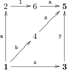

## 문제

Bytie-boy is one of the youngest habitats of Byteburg. Let the fact that he has only just learnt to read and write speak for his age. He is, however, old enough to go school by himself. Every morning he leaves home and comes by all his friends; the whole group goes to school together only when everyone is joined.

One day the teacher asked Bytie to prepare a list of the streets Bytie walks on his way to school, and to read it loud during the very next class. It soon turned out that the list is very long; so long in fact that it could take a vast amount of paper. Therefore it was decided that Bytie-boy would write down only the first letter from the name of every street he walks. The streets Byteburg are, with no exception, one-way, and each one connects two different crossings.

While reading the list of letters, Bytie makes a pause only at the spots at which he picked up a friend. Thus each part of his walk can be treated as a single word. Reading is still somewhat difficult for the boy: sometimes he reads from right to left instead of left-to-right. So he may read the word milk as milk, but also as klim. As Bytie's parents are aware of his problems, they decided to aid him by finding a route whose every fragment remains the same whether it is read left-to-right or right-to-left. For obvious reasons, the parents would also like to keep each fragment (word) as short as possible. They ask you for help.

Write a programme that

* reads the city's description from the standard input,
* determines a route from Bytie's house to the school such that each of its fragments is as short as possible and its description reads the same left-to-right and right-to-left,
* prints out the description (with fragments suitably separated) to the standard output.

## 입력

The first line of the standard input contains two integer, n and m, separated by a single space (2 ≤ n ≤ 400, 1 ≤ m ≤ 60,000). These denote, respectively, the number of crossings in Byteburg and the number of streets connecting them. The streets descriptions follow in the next m lines. Three numbers are given in the (i+1)-th line: xi, yi, ci (1 ≤ xi ≤ n, 1 ≤ yi ≤ n, xi≠yi); these denote, respectively, the start of the street, the end of the street, and the first letter of the street's name, and are separated by single spaces. The letters are lowercase, English. Any two crossings are connected by at most one street per direction (at most one in one direction and at most one in the opposite). The following line contains a single integer d (2 ≤ d ≤ 100) denoting the number of crossings that Bytie-boy passes through on his way to school. The next line contains d integers si (1 ≤ si ≤ n), also separated by single spaces. These mean that Bytie lives by the crossing no. si, the school is by the crossing no. sn, and along the way Bytie picks up successively his friends living by the crossings no. sn,s2,s3,…,sn-1. Every two successive numbers of crossings on the list are distinct, but some two numbers on the list can be the same. Moreover, if it is not possible to get from one crossing to another complying with restrictions set in the task, Bytie takes a short cut and writes nothing on his sheet.

## 출력

The output should consist of d-1 lines. There should be a number ri ans a sequence of characters wi in the i-th line, separated by a single space. The number ri denotes the minimum length of the route complying with the task's conditions that connects the crossings si and si+1, while wi is the sequence of first letters of the streets in this rout. If there is no route between some two crossings that satisfies aforementioned conditions, -1 should be output. It is possible there are several possible sequences wi. In that case print any.

## 힌트

