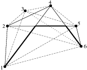

## 문제

Byteasar is the king of Byteotia, an island in The Ocean of Happiness. The island is a convex shape, and all the towns of Byteotia are located on the shore. One of these towns is Byteburg, the famous capital of Byteotia. Every pair of towns is connected by a road that goes along the line segment between the towns. Some roads that connect different pairs of towns intersect - there is a crossroad at each such intersection.

Bitratio, Byteasar's rival to the throne, had hatched a sordid plot. While Byteasar was travelling from the capital to an adjacent town, Bitratio's people seized Byteburg. Now Byteasar has to return to Byteburg as soon as possible in order to restore his rule. Unfortunately, some of the roads are controlled by Bitratio's guerrilla. Byteasar cannot risk the use of such roads, he can however cross them at the crossroads. Needless to say, he has to travel along the roads and hence turn only at the crossroads, for otherwise the journey would take far too long.

Byteasar's loyal servants have informed him which roads are safe. Byteasar believes your loyalty, and thus entrusts you with a task to find the shortest safe route from the town he is currently in to Byteburg.

## 입력

In the first line of the standard input two integers n and m are given (3 ≤ n ≤ 100,000, 1 ≤ m ≤ 1,000,000), separated by a single space, that denote respectively: the number of towns and the number of roads controlled by Bitratio's guerrilla. Let us number the towns from 1 to n starting from Byteburg and moving clockwise along the shore. Bytesar is currently in the town no. n. Each of the following n lines holds a pair of integers xi and yi (-1,000,000 ≤ xi,yi ≤ 1,000,000), separated by a single space, that denote the town's no i coordinates.

Each of the following m lines contains a pair of integers aj and bj (1 ≤ aj < bj ≤ n). Such pair means that the road connecting the towns aj and bj is controlled by Bitratio's guerrilla. Every such pair is unique. You can assume that in every test data set Byteasar can get to Byteburg.

## 출력

Your programme is to print out one floating point number to the standard output: the length of the shortest safe route leading from the town no. n to Byteburg. The absolute difference between the number returned and the correct one has to be at most 10^(-5).

## 힌트

The route that Byteasar should follow leaves town no. 6 in the direction of town no. 4, then turns to the road connecting towns no. 2 and 5, and finally goes along the road connecting Byteburg with the town no. 4.
