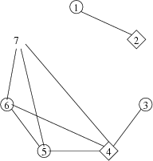

## 문제

King Byteasar faces a serious matter. Two competing trade organisations, The Tailors Guild and The Sewers Guild asked, at the same time, for permissions to open their offices in each town of the kingdom.

There are n towns in Byteotia. Some of them are connected with bidirectional roads. Each of the guilds postulate that every town should:

* have an office of the guild, or
* be directly connected to another town that does.

The king, however, suspects foul play. He fears that if there is just a single town holding the offices of both guilds, it could lead to a clothing cartel. For this reason he asks your help.

## 입력

Two integers, n and m (1 ≤ n ≤ 200,000, 0 ≤ m ≤ 500,000), are given in the first line of the standard input. These denote the number of towns and roads in Byteotia, respectively. The towns are numbered from 1 to n. Then the roads are given as follows: the input line no.i+1  describes the i-th road; it holds the numbers ai and bi (1 ≤ ai,bi ≤ n, ai≠bi), denoting that the i-th road connects the towns  and . Every pair of towns is (directly) connected by at most one road. The roads do not cross - meeting only in towns - but may lead through tunnels and overpasses.

## 출력

Your program should print out one word in the first line of the standard output: TAK (yes in Polish) - if the offices can be placed in towns according to these rules, or NIE (no in Polish) - in the opposite case. If the answers is TAK, then the following n lines should give an exemplary placement of the offices. Thus the line no. i+1 should hold:

* the letter K if there should be an office of The Tailors Guild in the town i, or
* the letter S if there should be an office of The Sewers Guild in the town i, or
* the letter N if there should be no office in the town i.

## 힌트

The towns in which an office of The Tailors Guild should open are marked with circles, whereas those in which an office of The Sewers Guild should open are marked with rhombi.
