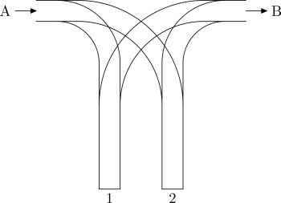

## 문제

A railroad siding consists of two (dead-end) sidetracks 1 and 2. The siding is entered by track A, and left by track B (see figure below).

There are n cars on track A, numbered from 1 to n. They are arranged in such a way that they enter the siding in the order a1,a2,…,an. The cars are to be transferred to the siding, so that they leave it by track B in the order 1,2,…,n. Each car is to be transferred once from track A to one of the sidetracks 1 or 2, and later (possibly after some transfers of the remaining cars) once from that sidetrack to the track B. The sidetracks are long enough to store even the longest trains, so there is no need to worry about their capacity.

## 입력

The first line of the standard input holds one integer n (1 ≤ n ≤ 100,000) that denotes the number of cars for transfer. The second line stores the numbers a1,a2,…,an that are a permutation of 1,2,…,n (i.e., each ai belongs to {1,2,…,n}, and all these numbers are unique), separated by single spaces.

## 출력

The first line of the standard output should contain the word TAK (yes in Polish) if there is a way of transferring the cars so that they enter track B in the order 1,2,…,n, or the word NIE (no in Polish) if it is impossible. If the answer is TAK, the second line should give, separated by single spaces, the numbers of sidetracks (1 or 2) to which successive cars a1,a2,…,an are moved in a correct transfer. If there are several ways of making the transfer, choose one arbitrarily.

## 힌트

In the first example we start by moving car1  to the first sidetrack, and move it to track B instantly. Then the car 3 is moved to the first sidetrack, and car 4 to the other one. Finally, the car 2 is moved to the first sidetrack, after which the cars 2 and 3 leave it to enter track B, followed by the car 4, which enters track B from the second sidetrack.
