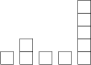

## 문제

Bytie has got a set of wooden blocks for his birthday. The blocks are indistinguishable from one another, as they are all cubes of the same size. Bytie forms piles by putting one block atop another. Soon he had a whole rank of such piles, one next to another in a straight line. Of course, the piles can have different heights.

Bytie's father, Byteasar, gave his son a puzzle. He gave him a number k and asked to rearrange the blocks in such a way that the number of successive piles of height at least k is maximised. However, Bytie is only ever allowed to pick the top block from a pile strictly higher than k and place it atop one of the piles next to it. Further, Bytie is not allowed to form new piles, he can only move blocks between those already existing.

## 입력

In the first line of the standard input there are two integers separated by a single space: n (1 ≤ n ≤ 1,000,000), denoting the number of piles, and m (1 ≤ m ≤ 50), denoting the number of Byteasar's requests. The piles are numbered from 1 to n. In the second line there are n integers x1,x2,…,xn  separated by single spaces (1 ≤ xi ≤ 1,000,000,000). The number xi denotes the height of the i-th pile. The third line holds m integers k1,k2,…,km separated by single spaces (1 ≤ ki ≤ 1,000,000,000). These are the subsequent values of the parameter k for which the puzzle is to be solved. That is, the largest number of successive piles of height at least k that can be obtained by allowed moves is to be determined for each given value of the parameter k.

## 출력

Your program should print out m integers, separated by single spaces, to the standard output - the i-th of which should be the answer to the puzzle for the given initial piles set-up and the parameter ki.

## 힌트

