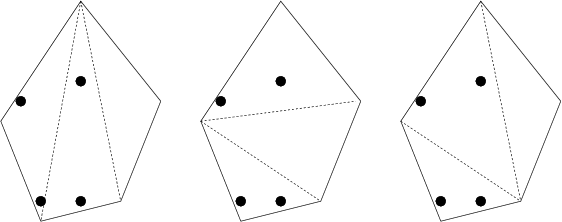

## 문제

The habitants of the Byteotian Highland bred sheep for centuries. Every sane shepherd has a fenced pasture in the shape of a convex-주석1 polygon for the sheep to graze on. Every sane sheep in turn has its own favourite feeding spot on the pasture where it spends all days. Sometimes however, the sheep want to play. As they play in pairs, every shepherd keeps an even number of sheep, so that his every sheep has a partner to play with.

The shepherds are concerned about a decree recently issued by the Byteburg's High Commissioner for Agriculture. The decree states that as of the next year the sheep can only graze on triangle-shaped pastures. Thus every shepherd whose pasture is an n-gon for n > 3 is to partition it into triangles by putting n-3 fences inside. Each single new fence, of course, is going to be a segment connecting two vertices of the polygon (pasture). Additionally, the fences can intersect only in these vertices. A shepherd who does not fulfil these requirements will no longer be subsidized.

Byteasar, as a shepherd, has to decide on a way of partitioning his pasture. In fact, he is unsure how many partitions are possible. He is only interested in such partitions that no fence is drawn through a favourite spot of any sheep, and such that every resulting triangle contains the favourite spots of an even number of sheep, so that these sheep can play in pairs. Help Byteasar by writing a program that calculates the number of such partitions!

## 입력

The first line of the standard input contains three integers n, k and m (4 ≤ n ≤ 600, 2 ≤ k ≤ 20,000, 2 | k, 2 ≤ m ≤ 20,000), separated by single spaces, that denote respectively: the number of vertices of the polygon forming the pasture, the number of the sheep, and a certain positive integer m. Each of the following n lines contains two integers xi and yi (-15,000 ≤ xi,yi ≤ 15,000), separated by a single space, denoting the coordinates of the i-th vertex of the pasture. The vertices are given in a clockwise order. Each of the k lines that follow holds two integers pj, qj (-15,000 ≤ pj,qj ≤ 15,000), separated by a single space, denoting the coordinates of the favourite spot of the j-th sheep. All the favourite spots lie strictly inside (i.e., not on the boundary) the pasture.

## 출력

Your program should print one integer on the standard output, namely the remainder of division by m of the number of partitions of the pasture in triangles, such that no fence is drawn through a favourite spot of any sheep, and every resulting triangle contains the favourite spots of an even number of sheep.

## 힌트

The figure depicts three possible partitions into triangles. The favourite spots of the sheep are marked with dots.

A convex polygon is a simple polygon (i.e., one with no self-intersections), in which every internal angle is smaller than 180°.
