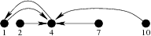

## 문제

On the bed of one particularly long and straight Byteotian brook there lie n rocks jutting above the water level. Their distances from the brook's spring are p1 < p2 < … < pn respectively. A small frog sitting on one of these is about to begin its leaping training. Each time the frog leaps to the rock that is the k-th closest to the one it is sitting on. Specifically, if the frog is sitting on the rock at position pi, then it will leap onto such pj that:

|{pa : |pa-pi| < |pj-pi|}| ≤ k and |{pa : |pa-pi| ≤ |pj-pi|}| > k.

If pj is not unique, then the frog chooses among them the rock that is closest to the spring. On which rock the frog will be sitting after m leaps depending on the rock is started from?

## 입력

The first line of the standard input holds three integers, n, k and m (1 ≤ k < n ≤ 1,000,000, 1 ≤ m ≤ 1018), separated by single spaces, that denote respectively: the number of rocks, the parameter k, and the number of intended leaps. The second line holds n integers pj (1 ≤ p1 < p2 < … < pn ≤ 1018), separated by single spaces, that denote the positions of successive rocks on the bed of the brook.

## 출력

Your program should print a single line on the standard output, with n integers r1, r2, …, rn from the interval [1,n] in it, separated by single spaces. The number ri denotes the number of the rock that the frog ends on after making m leaps starting from the rock no. i (in the input order).

## 힌트

The figure presents where the frog leaps to (in a single leap) from each and every rock.
