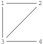

## 문제

Hostile Bitotia launched a sneak attack on Byteotia and occupied a significant part of its territory. The King of Byteotia, Byteasar, intends to organise resistance movement in the occupied area. Byteasar naturally started with selecting the people who will form the skeleton of the movement. They are to be partitioned into two groups: the conspirators who will operate directly in the occupied territory, and the support group that will operate inside free Byteotia.

There is however one issue - the partition has to satisfy the following conditions:

* Every pair of people from the support group have to know each other - this will make the whole group cooperative and efficient.
* The conspirators must not know each other.
* None of the groups may be empty, i.e., there has to be at least one conspirator and at least one person in the support group.

Byteasar wonders how many ways there are of partitioning selected people into the two groups. And most of all, whether such partition is possible at all. As he has absolutely no idea how to approach this problem, he asks you for help.

## 입력

The first line of the standard input holds one integer n (2 ≤ n ≤ 5,000), denoting the number of people engaged in forming the resistance movement. These people are numbered from 1 to n(for the sake of conspiracy!). The n lines that follow describe who knows who in the group. The i-th of these lines describes the acquaintances of the person  with a sequence of integers separated by single spaces. The first of those numbers, ki (0 ≤ ki ≤ n-1), denotes the number of acquaintances of the person i. Next in the line there are ki integers ai,1,ai,2,…,ai,ki - the numbers of i’s acquaintances. The numbers aij are given in increasing order and satisfy 1 ≤ aij ≤ n, aij ≠ i. You may assume that if x occurs in the sequence ai(i.e., among i’s acquaintances), then also i occurs in the sequence ax (i.e., among x’s acquaintances).

## 출력

In the first and only line of the standard output your program should print out one integer: the number of ways to partition selected people into the conspirators and the support group. If there is no partition satisfying aforementioned conditions, then 0 is obviously the right answer.

## 힌트

There are three ways of partitioning these people into the groups. The group of conspirators can be formed by either those numbered 1 and 4, those numbered 2 and 4, or the one numbered 4 alone.
