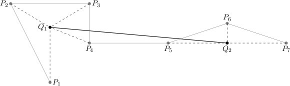

## 문제

We call any sequence of points in the plane a plot. We intend to replace a given plot (P1,…,Pn) with another that will have at most m points (m ≤ n) in such a way that it "resembles" the original plot best.

The new plot is created as follows. The sequence of points P1,…,Pn can be partitioned into  s (s ≤ m) contiguous subsequences:

    (P\_{ko+1},…,P\_k1), (P\_{k1+1},…,P\_k2), …, (P\_{k(s-1)+1},…,P\_ks)

where 0 = k0 < k1 < k2 < … < ks = n, and afterwards each subsequence (Pk(i-1)+1,…,Pki), for i=1,…,s, is replaced by a new point Qi. In that case we say that each of the points Pk(i-1)+1,…,Pki has been contracted to the point Qi. As a result a new plot, represented by the points Q1,…,Qs, is created. The measure of such plot's resemblance to the original is the maximum distance of all the points P1,…,Pn to the point it has been contracted to:

    \( \max\_{i=1Idots,s} {\left(\max\_{j=k\_{i-1}+1,...,k\_i} {(d(P\_j,Q\_i))}\right)} \)

where d(Pj,Qi) denotes the distance between Pj and Qi, given by the well-known formula:

    \( d((x\_1,y\_1),(x\_2,y\_2)) = \sqrt{(x\_2-x\_1)^2+(y\_2-y\_1)^2} \)

  
An exemplary plot (P1,…,P7) and the new plot (Q1,Q2), where (P1,…,P4) are contracted to Q1, whereas (P5,P6,P7) to Q2.

For a given plot consisting of n points, you are to find the plot that resembles it most while having at most m points, where the partitioning into contiguous subsequences is arbitrary. Due to limited precision of floating point operations, a result is deemed correct if its resemblance to the given plot is larger than the optimum resemblance by at most 0.000001.

## 입력

In the first line of the standard input there are two integers n and m, 1 ≤ m ≤ n ≤ 100,000, separated by a single space. Each of the following n lines holds two integers, separated by a single space. The (i+1)-th line gives xi,yi, -1,000,000 ≤ xi,yi ≤ 1,000,000, denoting the coordinates (xi,yi) of the point Pi.

## 출력

In the first line of the standard output one real number d should be printed out, the resemblance measure of the plot found to the original one. In the second line of the standard output there should be another integer s, 1 ≤ s ≤ m. Next, the following s lines should specify the coordinates of the points Q1,…,Qs, one point per line. Thus the (i+2)-th line should give two real numbers ui and vi, separated by a single space, that denote the coordinates (ui,vi) of the point Qi. All the real numbers should be printed with at most 15 digits after the decimal point.
