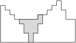

## 문제

Byteasar has set off on a journey along the Dry River, which crosses the Byteotian Desert. Unfortunately, the Dry River has dried out, and Byteasar has run out of water. His only hope is to dig a deep enough well in the dried river bed.

Realising the graveness of his situation, Byteasar decides to plan everything carefully before he actually starts digging. The danger is that he drains his strength before he reaches the water level - in such case he is unlikely to survive. He managed to determine the depth of the water level. He also knows how much he can dig before losing strength. His only worry is a possible landslide, which might bury him alive. He sends you (via a satellite telephone) a topographic map of the river bed. And, of course, he asks you to help him determine where he should dig so that he reaches water before draining his strength while keeping the slope of his excavation as gentle as possible. He is waiting for your advice!

## 입력

In the first line of the standard input two positive integers are given, n and m (1 ≤ n ≤ 1,000,000, 1 ≤ m ≤ 1018), separated by a single space. The second line holds n positive integers x1,x2,…,xn (1 ≤ xi ≤ 109), also separated by single spaces.

Byteasar has enough energy to perform  swings of the shovel. The numbers x1,x2,…,xn  describe the topography of the Dry River's bed. They represent the depth of the sand layer above the ground water level in successive one meter spaced spots along the river bed. With a single swing of the shovel Byteasar can extract an amount of the sand that decreases any of the numbers xi by 1. If any of these numbers, say xk, drops to 0, this means that Byteasar has dug down to the water. But Byteasar has a secondary goal as well. He wants the following number z, characterising the slope of the sand hill, minimised:

    z= \( \max\_{i=1,2,...,n-1} {|x\_i - x\_{i+1}|} \)

If there are multiple correct values of the number k, representing the spot where Byteasar is to dig down to reach the water, your program can pick one arbitrarily. The spots 1,2,…,n are the only ones suitable for digging - elsewhere there is rock rather than sand. You may assume that Byteasar has enough energy to reach water at one of the spots.

In tests worth at least 35% of points it additionally holds that n ≤ 10,000.

## 출력

Your program should print two integers to the standard output, separated by a single space: the spot k, where Byteasar should dig for water, and the minimum value of the number z.

## 힌트

In above figure the best excavation that Byteasar can make is marked with the grey colour.
