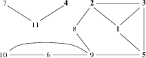

## 문제

There are n town in Byteotia. Some pairs of those are connected by bidirectional roads. The roads meet only at their endpoints, and thus do not cross; this is possible due to a system of tunnels and flyovers.

Soon a famous bicycle race, Tour de Byteotia, will begin. It is already known that the race's route will follow some Byteotian roads, will start and end in the same town, and will pass along any road at most once.

Byteasar is a famous Byteotian fan, the chief of the football team Byties fan club. Byteasar and his club pals detest all bicycle races. They want to block some roads so that the race's route cannot lead through the towns they live in. Byteasar knows in which towns the members of his club live. He wants to determine the minimum set of roads that have to be blocked in order to prevent the race from passing through any of the towns his club pals (including him) live in; to clarify: for every such town the race cannot lead through it. Your task is to help Byteasar in finding the proper set of roads.

## 입력

In the first line of the standard input there are three integers, n, m, and k (1 ≤ n ≤ 1,000,000, 0 ≤ m ≤ 2,000,000, 1 ≤ k ≤ n), separated by single spaces, that denote, respectively: the number of towns, the number of roads, and the number of towns the club members live in. The towns are numbered from 1 to n in such a way that the towns in which the club members live are numbered from 1 to k. Each of the m lines that follow holds two integers, ai and bi (1 ≤ ai < bi ≤ n), separated by a single space, that indicate that the towns ai and bi are connected by a bidirectional road. Each pair of Byteotian towns is (directly) connected by at most one road.

In tests worth 40% of the total points n ≤ 1,000 and m ≤ 5,000 hold in addition.

## 출력

Your program should print out to the standard output a set of roads of minimum cardinality whose blockage would prevent the race from passing through any of the towns where the club members live in.

The program is to print this minimum cardinality in the first line of the output. In the following lines it is to specify the set of roads to be blocked, one road per line. For a given road, it should print the numbers of towns connected by it with the town with lower number coming first, and the numbers separated by a single space.

If more than one solution exists, your program should pick one arbitrarily.

## 힌트

