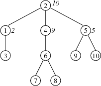

## 문제

The Byteotian Software Corporation (BSC) has n employees. In BSC's strict hierarchy, each employee has a direct supervisor, except the CEO, to whom all other BSC employees answer, directly or not. Each employee has a unique monthly salary, and all their salaries range from 1 to n bythalers. Each supervisor earns more than each of their subordinates.

According to Byteotian law, the salaries of employees on certain posts may be publicly disclosed. Furthermore, if the salary of an employee is disclosed, then the salary of their supervisor is also disclosed.

The Byteotian Internal Revenue Anti-Corruption Service (BIRAS) has decided to investigate BSC. Before BIRAS enters BSC with a warrant, they intend to learn the salaries of all BSC employees that are not disclosed but can be determined from those that are disclosed.

## 입력

In the first line of the standard input a single integer n (1 ≤ n ≤ 1,000,000) is given that denotes the number of BSC employees. The employees have id's that range from 1 to n.

The n lines that follow provide information on these employees. The line no. i+1 describes the employee no. i by two integers pi and zi (1 ≤ pi ≤ n, 0 ≤ zi ≤ n), separated by a single space. The number pi is the id of the direct supervisor of the employee i. If pi=i, then i is the CEO of BSC. If zi > 0, then that is the salary of the employee i. If, on the other hand, zi=0, then the salary of employee  is not disclosed. Those zi’s that are positive are also pairwise different.

The input data will always be such that there is at least one assignment of salaries to employees consistent with them, i.e., with the hierarchy and the partial assignment that they provide.

In tests worth 54% of the total points the condition n ≤ 10,000 holds in addition.

## 출력

Your program should print n lines to the standard output, each line holding a single integer. If the employee i’s salary is disclosed or can be inferred from disclosed salaries, then the  i-th line should hold employee i’s salary. Otherwise the i-th line should contain 0.

## 힌트

The figure illustrates the hierarchy of employees. The encircled numbers are employee id's, whereas the numbers in italics given next to them (if any) are their disclosed salaries. The employee 3 has to earn 1 bythaler, and employee 6 has to earn 8 bythalers. The salaries of employees 7, 8, 9 and 10 cannot be uniquely determined from disclosed salaries.
