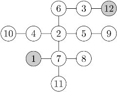
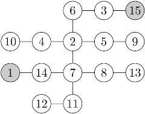

## 문제

Byteasar lives in Byteburg, a city famous for its milk bars on every corner. One day Byteasar came up with an idea of a "milk multidrink": he wants to visit each milk bar for a drink exactly once. Ideally, Byteasar would like to come up with a route such that the next bar is always no further than two blocks (precisely: intersections) away from the previous one.

The intersections in Byteburg are numbered from  to , and all the streets are bidirectional. Between each pair of intersections there is a unique direct route, ie, one that does not visit any intersection twice. Byteasar begins at the intersection no.  and finishes at the intersection no. .

Your task is to find any route that satisfies Byteasar's requirements if such a route exists.

An exemplary route satisfying the requirements is: 1,11,8,7,5,9,2,10,4,6,3,12.

There is no route that satisfies the requirements.

## 입력

In the first line of the standard input there is a single integer n (2 ≤ n ≤ 500,000), denoting the number of intersections in Byteburg. Each of the following n-1 lines holds a pair of distinct integers ai and bi (1 ≤ ai,bi ≤ n), separated by a single space, that represent the street linking the intersections no. ai and bi.

## 출력

If there is no route satisfying Byteasar's requirements, your program should print a single word "BRAK" (Polish for none), without the quotation marks to the standard output. Otherwise, your program should print n lines to the standard output, the i-th of which should contain the number of the i-th intersection on an arbitrary route satisfying Byteasar's requirements. Obviously, in that case the first line should hold the number 1, and the n-th line - number n.
