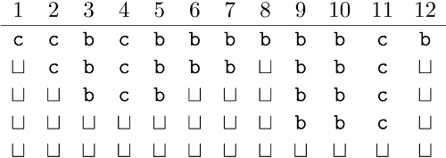

## 문제

Little Edna has received the take-out game as a present. Take-out is a single player game, in which the player is given a sequence of n adjacent blocks, numbered from 1 to n. Each block is either black or white, and there are k times as many white blocks as there are black ones.

The player's goal is to remove all the blocks by certain permissible moves.

A single move consists in removing exactly k white blocks and a single black block without changing the positions of other blocks. The move is permissible if there is no "gap" (a space left by a previously taken out block) between any two blocks being removed.

Help poor little Edna in finding any sequence of permissible moves that remove all the blocks.

## 입력

In the first line of the standard input there are two integers, n and k (2 ≤ n ≤ 1,000,000, 1 ≤ k ≤ n-1), separated by a single space, that denote the total number of blocks used in the game, and the number of white blocks per black node (to be removed in every move). In all the tests the condition k+1|n holds.

In the second line there is a string of n letters b or c. These tell the colours of successive blocks (in Polish): b (for biały) - white, c (for czarny) - black. You may assume that in all the tests there exists a sequence of permissible moves that takes out all the blocks.

## 출력

Your program should print \( \frac{n}{k+1} \) lines to the standard output. Successive lines should describe successive moves. Each line should contain k+1 integers, in increasing order, separated by single spaces, that denote the numbers of blocks to be removed in the move.

## 힌트

Let  denote the empty space after a block that was taken out (the gap). By executing the sequence of moves given above, we obtain the following configurations of blocks, in this order: Wykonując podane powyżej ruchy, uzyskujemy kolejno następujące układy klocków:

