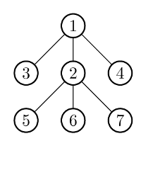

## 문제

The king of Byteotia, Byteasar, is returning to his country after a victorious battle. In Byteotia, there are n towns connected with only n-1 roads. It is known that every town can be reached from every other town by a unique route, consisting of one or more (direct) roads. (In other words, the road network forms a tree).

The king has just entered the capital. Therein a triumphal arch, i.e., a gate a victorious king rides through, has been erected. Byteasar, delighted by a warm welcome by his subjects, has planned a triumphal procession to visit all the towns of Byteotia, starting with the capital he is currently in.

The other towns are not ready to greet their king just yet - the constructions of the triumphal arches in those towns did not even begin! But Byteasar's trusted advisor is seeing to the issue. He desires to hire a number of construction crews. Every crew can construct a single arch each day, in any town. Unfortunately, no one knows the order in which the king will visit the towns. The only thing that is clear is that every day the king will travel from the city he is currently in to a neighboring one. The king may visit any town an arbitrary number of times (but as he is not vain, one arch in each town will suffice).

Byteasar's advisor has to pay each crew the same flat fee, regardless of how many arches this crew builds. Thus, while he needs to ensure that every town has an arch when it is visited by the king, he wants to hire as few crews as possible. Help him out by writing a program that will determine the minimum number of crews that allow a timely delivery of the arches.

## 입력

The first line of the standard input contains a single integer n (1 ≤ n ≤ 300,000), the number of towns in Byteotia. The towns are numbered from 1 to , where the number 1 corresponds to the capital.

The road network is described in n-1 lines that then follow. Each of those lines contains two integers, a,b (1 ≤ a,b ≤ n), separated by a single space, indicating that towns a and b are directly connected with a two way road.

## 출력

The first and only line of the standard output is to hold a single integer, the minimum number of crews that Byteasar's advisor needs to hire.

## 힌트

On the first day, triumphal arches need to be erected in towns 2, 3, 4. On the second day, they should be erected in towns 5, 6, 7.

