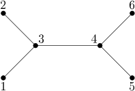

## 문제

A tree is an undirected graph in which any two nodes are connected with at most one simple path, that is, a path without repeating nodes.

Consider a tree with n nodes numbered 1 through n. Let P be a permutation of the set of nodes of the tree, that is, a one-to-one function (injection) P : {1, 2, ..., n} → {1, 2, ..., n}. The permutation P is called an automorphism if for any two nodes u, v of the tree, the nodes P(u) and P(v) are connected with an edge if and only if u and v are connected with an edge.

We would like to know what is the number of different automorphisms of a given tree modulo 1,000,000,007.

## 입력

The first line of the standard input contains an integer n (1 ≤ n ≤ 500,000): the number of nodes of the tree. Each of the following n-1 lines contains two integers ui and vi (1 ≤ ui < vi ≤ n) that represent an edge connecting the nodes ui and vi.

## 출력

The first and only line of the standard output should contain one integer: the number of different automorphisms of the given tree modulo 1,000,000,007.

## 힌트

This tree has 8 automorphisms, in particular, the following three:

* p(i) = i for i = 1, 2, 3, 4, 5, 6
* q(i) = i for i = 1, 2, 3, 4, q(5) = 6, q(6) = 5
* r(1) = 6, r(2) = 5, r(3) = 4, r(4) = 3, r(5) = 1, r(6) = 2.
