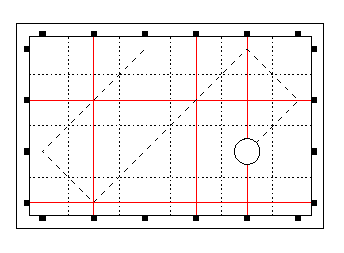

## 문제

Snobbish citizens of Byteotia enjoy playing the laser pool. The pool table has a shape of a n × m rectangle. The rails of the table are 1/4 wide and contain n + m pairs of laser transmitters. When all the transmitters are on, the table is covered by n "horizontal" and m "vertical" laser beams so that the i-th horizontal beam (for 1 ≤ i ≤ n) crosses the j-th vertical beam (for 1 ≤ j ≤ m) in the point (j - 1/2, i - 1/2). The transmitters can be turned on or off independently.

Laser pool is played with a ball of diameter 1/2. When the ball crosses at least one of the laser beams, a hit signal is displayed.

Initially the ball is located at the point (x - 1/2, y - 1/2). The ball was hit with a cue so that its initial velocity vector is (xv, yv) and it rolled without friction for t units of time. The collisions of the ball with the cushion were perfectly elastic. How many times was the hit signal displayed (possibly taking into account the initial moment of the ball's movement)?

## 입력

The first line of the standard input contains two integers n and m (3 ≤ n, m ≤ 100,000) that represent the dimensions of the table. The second line contains an n-character word composed of the digits 0 and 1. The i-th letter of the word describes the state of the i-th horizontal transmitter where 0 means that the transmitter is off and 1 means that it is on. The third line contains an m-character word that describes the state of the vertical transmitters.

The fourth line of the input contains an integer k (1 ≤ k ≤ 10,000): the number of queries. Each of the following k lines contains five integers x, y, xv, yv, t (1 < x < m, 1 < y < n, xv,yv ∈ {-1, 1}, 1 ≤ t ≤ 109) that describe the initial position, the velocity of the ball and the duration of its movement.

## 출력

Your program should output exactly k lines to the standard output: the answers to the respective queries. Each answer should have the form of a single integer: the number of times the hit signal was displayed.

## 힌트

