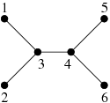

## 문제

Byteasar is going for a road trip around Byteland. Unfortunately, he was unable to buy a map of the country. From his friends he learned a few properties of the Bytean road network:

* There are n cities in Byteland, numbered 1 through n.
* Each road is bidirectional and connects two different cities.
* Each pair of different cities is connected by exactly one path, consisting of one or more roads, on which no city appears more than once.
* There are exactly di roads starting at the city number i.

Byteasar is going to reconstruct the road map of Byteland. The number of possible road networks satisfying the conditions can be quite big, so Byteasar will be satisfied with any correct plan.

## 입력

The first line of input contains one integer n (2 ≤ n ≤ 2,000,000). The second line contains n integers di (1 ≤ di ≤ n-1).

## 출력

If no road network plan satisfying the conditions from the input exists, the first and only line of output should contain a single word BRAK - i.e., none in Polish. In the opposite case each of the lines in the output should contain a description of one bidirectional road - two different integers in the range [1, n] denoting the numbers of cities connected by this road. Output each road exactly once. The order of roads and cities connected by roads in the output can be arbitrary.

## 힌트

