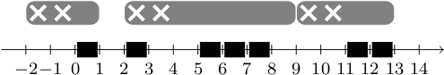

## 문제

Byteasar is going to watch a meteor shower tonight. He has read an exact prognosis of its route. He knows that the shower will be composed of n meteors and the i-th meteor will appear at ti-th second after midnight, i.e., it will be visible between moments ti - 1 and ti. For each meteor, Byteasar is only interested in watching it the whole time it is visible.

Byteasar will watch the sky from a nearby hill. He is not going to do it with a naked eye. On the hill there is a telescope which perfectly suits an amateur's needs. However, it is not for free. The telescope accepts coins. For each c inserted bythalers it allows to watch the sky for exactly c seconds. Unfortunately the telescope is a bit shabby, so after an insertion of a coin one must wait for r seconds before anything is visible. Every time only a single coin is accepted. Thus, if you insert a c coin, the next coin will be accepted only after at least r + c seconds.

Byteasar has m coins in his pocket with the values of c1, ..., cm bythalers. He is going to use them to pay for the telescope. He wonders what is the maximum number of meteors he can observe with the telescope.

## 입력

The first line of the input contains three integers n, m and r (1 ≤ n ≤ 100, 1 ≤ m ≤ 10, 1 ≤ r ≤ 108). The second line is composed of n integers t1, ..., tn given in the increasing order (1 ≤ ti ≤ 108). The third line contains m integers c1, ..., cm (1 ≤ ci ≤ 108).

## 출력

The only line of the output should contain one integer, i.e., the maximum number of meteors that Byteasar can observe with the telescope.

## 힌트

In the figure above black rectangles show seconds during which a meteor is visible. If Byteasar wants to see 6 meteors, he should insert his coins in moments -2, 2 and 9 in the following order of values: 1, 5 and 2 bythalers.
