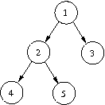

## 문제

In a fast developing firm, new employees are often hired. Each new employee p is assigned a direct superior, whose superiors (both direct and indirect) become indirect superiors of p.

We call the direct superior of p a superior of *degree* 0. The superior of a superior of degree 0 has a degree equal to 1. In general, a superior of a superior of degree k has degree k+1. In this way, an employee is a subordinate of his immediate superior and superiors of higher degree. This defines a hierarchy of all employees, which has the founder of the company on its top.

The history of all employees who have joined the company since the foundation is recorded. Some employees wonder for how many subordinates they are superiors of degree k. Would you mind writing a program, which will assist them in solving this problem, so that they could go back to work?

## 입력

In the first line of the standard input there is an integer n (1 ≤ n ≤ 105), denoting the number of events. The following n lines contain descriptions of the events, one per line, given in chronological order.

An event of hiring a new employee is described by a character '`Z`' and two integers pi and si (2 ≤ pi ≤ 105, pi ≠ pj for i ≠ j), which represent the numbers of the new employee and his immediate superior, respectively. si is equal to the number of some employee, who is currently hired. The founder is assigned number 1.

A question from an employee qi about the number of his subordinates, for whom he is a superior of degree ki, is described by a character '`P`' and two integers qi and ki (1 ≤ qi ≤ 105, 0 ≤ ki ≤ 105).

Before the first event the founder was the only person working in the firm.

## 출력

For each question from an employee output one line to the standard output with one integer equal to the number of subordinates of this employee, for whom he is a superior of degree ki.

## 힌트

