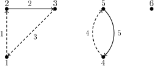

## 문제

Byteman is studying directed graphs. He especially likes graphs which do not contain cycles, since this is a class of graphs in which many problems can be solved easily and effectively. Now he is trying to find a method of representing any directed graph as a sum of acyclic graphs.

For a given directed graph he is trying to find a way to divide the set of its edges into a minimal number of subsets in such a way that the graphs constructed using the respective subsets of edges do not contain cycles. Could you write a program which solves Byteman's problem?

## 입력

The first line of the standard input contains two integers n and m (1 ≤ n, m ≤ 100,000), denoting the number of vertices and the number of edges in the graph, respectively. The vertices are numbered from 1 to n. Each of the following m lines contains a description of one edge of the graph as a pair of integers ai, bi (1 ≤ ai, bi ≤ n, ai ≠ bi). Such a pair denotes a directed edge of the graph from the vertex ai to the vertex bi. You may assume that the graph does not contain multiple edges.

## 출력

The first line of the standard output should contain a single integer k - the minimal number of acyclic graphs in any decomposition of the graph. Each of the following k lines should contain a description of one element of the decomposition, starting with an integer li denoting the number of edges in the ith element. It should be followed by an increasing sequence of li numbers of edges belonging to the ith element of the decomposition. The edges are numbered from 1 to m in the order in which they appear in the input. Each edge should be present in exactly one element of the decomposition.

If there are multiple correct solutions, your program should output any one of them.

## 힌트

Illustration of the example from the task statement. The circles represent the vertices, while the lines and arcs (continuous and dashed) represent the edges of the graph. The numbers next to the circles are the numbers of the vertices, and the numbers next to the lines/arcs are the numbers of edges. This graph can be decomposed into two acyclic graphs: the edges of the first one are denoted by continuous lines/arcs and the edges of the second one - by dashed lines/arcs.
