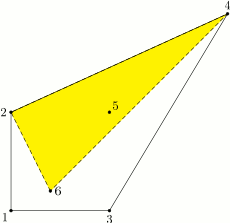

## 문제

The Byteland Army plans to conduct the greatest military exercise in its history this weekend. The exercise will take place on the training ground in Northern Bytetown. The officers of Byteland Army know this training ground perfectly; they do not, however, know the assignments. This is why they requested your help, recruit!

Your superiors know exactly where the strategic spots on the training ground are located. During the exercise they will be asked multiple times to capture various areas of the training ground. One of the most crucial decisions will be the allocation of forces and determining the strength needed to capture a particular area - this strength should be proportional to the number of strategic spots in the attacked area. Your task is to determine for each area, represented as a polygon with vertices in the strategic spots, the number of strategic spots lying strictly inside the interior of the area.

## 입력

In the first line of the standard input two integers n and m are given (3 ≤ n ≤ 1,000, 1 ≤ m ≤ 100,000), denoting respectively the number of strategic spots on the training ground and the number of queries. The strategic spots are numbered from 1 to n.

The next n lines give descriptions of the strategic spots. In the ith line two integers xi and yi (- 109 ≤ xi, yi≤ 109) are given, denoting the coordinates of the ith strategic spot. No three strategic spots are collinear.

The next m rows contain the descriptions of the m queries. Each description begins with an integer kj (3 ≤ kj ≤ n), denoting the number of vertices of the polygon. It is followed by kj different integers from the interval [1, n], which denote the identifiers of strategic spots that are subsequent vertices of the polygon. All the given polygons will be simple (i.e., without self-intersections), and their vertices are given in the clockwise order. The sum of all the numbers kj does not exceed 1,000,000.

## 출력

Your program should write m lines to the standard output. The jth line should contain one integer, being the number of strategic spots in the interior of the polygon described in the jth query.

## 힌트

The circles in the figure depict strategic spots, while the numbers next to the circles - their identifiers. The figure shows the areas from the first (continuous lines) and third (dashed lines, filled in yellow) query.
