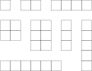

## 문제

상근이는 변의 길이가 1인 정사각형 n개를 가지고 있다. 이 정사각형을 이용해서 만들 수 있는 직사각형의 개수는 총 몇 개일까?

두 직사각형 A와 B가 있을 때, A를 이동, 회전시켜서 B를 만들 수 없으면, 두 직사각형은 다르다고 한다. 직사각형을 만들 때, 정사각형을 변형시키거나, 한 정사각형 위에 다른 정사각형을 놓을 수 없다. 또, 직사각형은 정사각형으로 꽉 차있어야 한다.

## 입력

첫째 줄에 n (1 ≤ n ≤ 10,000)이 주어진다.

## 출력

만들 수 있는 직사각형의 개수를 출력한다.

## 힌트

