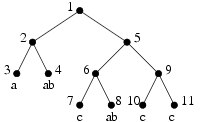
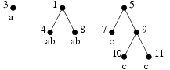

## 문제

Bajtazar prosi Cię o pomoc przy obrabianiu pewnego drzewa T. Jest to drzewo binarne, którego liście mają pewne etykiety (etykiety mogą się powtarzać). Dla każdej etykiety et Bajtazar chciałby zobaczyć drzewo T(et) o następujących własnościach:

* liśćmi drzewa T(et) są te liście drzewa T, które mają etykietę et,
* do drzewa T(et) bierzemy te wierzchołki wewnętrzne drzewa T, których oba poddrzewa (tzn. lewe i prawe) zawierają etykietę et,
* dwa wierzchołki drzewa T(et) łączymy krawędzią, jeśli w drzewie T istnieje między nimi ścieżka nie przechodząca przez żaden inny wierzchołek wzięty do drzewa T(et).

Pomóż Bajtazarowi i napisz program, który dla każdej etykiety et występującej w drzewie T wyznaczy drzewo T(et).

Zadanie

Napisz program, który:

* wczyta ze standardowego wejścia opis drzewa T,
* dla każdej etykiety et występującej w drzewie T wyznaczy drzewo T(et),
* wypisze opisy tych drzew na standardowe wyjście.

## 입력

W każdym wierszu standardowego wejścia opisany jest dokładnie jeden wierzchołek drzewa T. Drzewo to jest zapisane w kolejności pre-order. W pierwszym wierszu opisu drzewa (zarówno całego, jak i każdego poddrzewa) znajduje się opis korzenia, następnie (jeśli korzeń nie jest liściem) opis lewego poddrzewa, po czym opis prawego poddrzewa. Jeśli mamy do czynienia z wierzchołkiem wewnętrznym, w wierszu znajduje się pojedyńczy znak gwiazdki '\*'. W przypadku liścia, w wierszu znajduje się jego etykieta. Jest to niepusty napis, który może zawierać wyłącznie małe litery od 'a' do 'z'. Łączna długość wszystkich etykiet będzie nie większa niż 1000000 (każdą etykietę liczymy tyle razy, ile występuje na wejściu).

Wierzchołki drzewa numerowane są zgodnie z ich kolejnością występowania na wejściu, poczynając od 1 (czyli numer wierzchołka równa się numerowi wiersza).

## 출력

Twój program powinien wypisać na standardowym wyjściu opisy wszystkich drzew T(et), w kolejności leksykograficznej etykiet. Opis każdego drzewa powinien mieścić się w jednym wierszu. Podobnie jak na wejściu ma to być opis pre-order, jednak wypisywać należy numery wierzchołków, które są w drzewie. Zatem opis drzewa to numer korzenia, po czym (jeśli to nie liść) opisy lewego i prawego poddrzewa.

## 힌트

For the sample input:

For the sample output:

