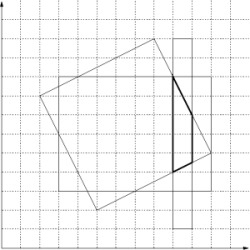

## 문제

Bajtazar dysponuje dużą liczbą map Polski. Niektóre mapy są samochodowe, inne turystyczne, itp. Wszystkie mapy mają kształt prostokąta. Dodatkowo mapy mogą być poobracane. Wszystkie mapy zawierają interesujące informacje o różnych miejscach w Polsce. Bajtazar będąc w danym punkcie chciałby, aby ten punkt był na każdej z map. W związku z tym zastanawia się nad kształtem części wspólnej wszystkich map. Wiadomo, że część wspólna jest wielokątem. Wystarczy, że znajdziesz liczbę krawędzi tego wielokąta.

- Zadanie

Twój program powinien

* wczytać listę prostokątów reprezentujących obszar pokryty przez każdą z map,
* wypisać liczbę krawędzi części wspólnej tych prostokątów.

## 입력

Pierwszy wiersz wejścia zawiera jedną liczbę całkowitą n (1 ≤ n ≤ 1,000,000) oznaczającą liczbę prostokątów. Kolejne n wierszy zawiera opisy prostokątów. Opis prostokąta składa się z ośmiu liczb całkowitych pooddzielanych pojedynczymi odstępami, oznaczających 4 pary współrzędnych 1 ≤ x,y ≤ 10,000 kolejnych wierzchołków prostokąta w kolejności przeciwnej do ruchu wskazówek zegara. Możesz założyć, że pole powierzchni części wspólnej prostokątów jest większe od zera.

## 출력

Jedyny wiersz wyjścia powinien zawierać jedną liczbę całkowitą - liczbę krawędzi części wspólnej prostokątów.

## 힌트

