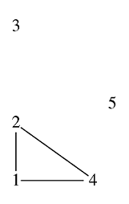

## 문제

W Bajtocji jest *n* miast, których położenie możemy przedstawić w postaci punktów na płaszczyźnie o całkowitych współrzędnych. Odległość między dwoma miastami o współrzędnych (*x*1, *y*1) i (*x*2, *y*2) jest określona w standardowy sposób: √((*x*2 - *x*1)2 + (*y*2 - *y*1)2).

Król Bajtocji, Bajtazar, chce wyznaczyć trzy miasta, które połączy i zamieni w *Trójmiasto* (wzorem pewnego egzotycznego królestwa, w którym w Trójmieście odbywają się finały tamtejszej OI oraz rozmaitych międzynarodowych zawodów programistycznych). Bajtazar postanowił wybrać takie trzy miasta, dla których suma odległości pomiędzy każdymi dwoma z nich jest minimalna.

## 입력

Pierwszy wiersz standardowego wejścia zawiera jedną liczbę całkowitą *n* (3 ≤ *n* ≤ 106) oznaczającą liczbę miast w Bajtocji. Miasta są ponumerowane od 1 do *n*. W kolejnych *n* wierszach znajdują się po dwie liczby całkowite *xi* i *yi* (0 ≤ *xi*, *yi* ≤ 109) oddzielone pojedynczym odstępem, oznaczające współrzędne *i*-tego wierzchołka miasta.

## 출력

Pierwszy wiersz standardowego wyjścia powinien zawierać jedną liczbę, równą minimalnej sumie odległości pomiędzy miastami wybranego Trójmiasta, zapisaną z dokładnością do dwóch miejsc po przecinku.

## 힌트

Bajtazar wybierze miasta: 1, 2 i 4.
