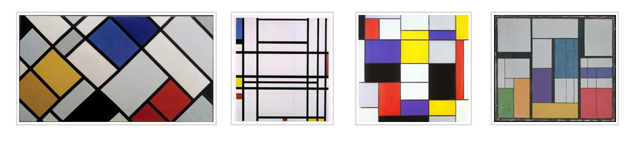
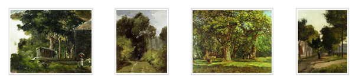
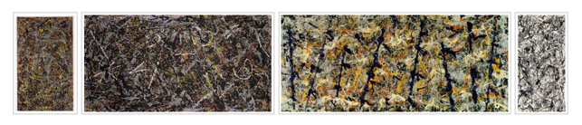
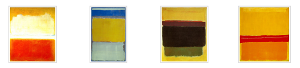

## 문제

미술사 시험을 앞두고 있는 당신은, 미술 수업보다는 정보 수업에 더 관심이 있다. 따라서 당신을 대신해서 시험을 치를 수 있는 프로그램을 작성해 보고자 한다.

시험에서는 여러 그림들이 주어진다. 각 그림은 1, 2, 3, 4로 번호 붙여진 서로 다른 특징을 가지는 스타일들 중 하나에 속한다.

스타일 1은 현대 신조형주의 그림들이다. 다음은 그 몇 가지 예이다.

스타일 2는 인상주의 풍경화들이다. 다음은 그 몇 가지 예이다.

스타일 3은 물감을 뿌려서 그리는 표현주의 그림들이다. 다음은 그 몇 가지 예이다.

스타일 4는 물감을 캔버스에 넓게 펴 발라 표현하는 색면회화 그림들이다. 다음은 그 몇 가지 예이다.

당신이 할 일은 그림의 디지털 이미지가 주어질 때 그 그림이 어떤 스타일에 속하는지 결정하는 것이다.

IOI 심사위원들은 각 스타일의 많은 이미지들을 수집하였다. 각 스타일마다 아홉개의 이미지들이 랜덤하게 선택되어 당신의 컴퓨터의 문제 자료 안에 저장되어 있으므로, 그 그림들을 직접 검토하고 테스트를 위해 사용할 수 있다. 제공되지 않은 이미지들은 채점에 사용될 것이다.

이미지는 크기가 H×W 인 픽셀 그리드로 주어진다. 이미지의 행들은 위에서 아래로 0, …, H - 1 로 번호가 매겨지고, 열들은 왼쪽에서 오른쪽으로 0, …, W - 1 로 번호가 매겨진다.

픽셀들은 세 개의 이차원 배열 R, G, B 로 표현이 되는데, 각각 이미지 픽셀들의 빨간색, 초록색, 파란색의 강도를 나타낸다. 강도는 정수이며 그 범위는 0(빨간색, 초록색, 또는 파란색이 없음)에서 255(빨간색, 초록색, 또는 파란색이 가장 진함)까지이다.

## 입력

첫째 줄에 H와 W가 주어진다. (100 ≤ H, W ≤ 500) 둘째 줄부터 H개 줄에는 R[i][j]의 값이 주어진다. 그 다음 줄부터 H개 줄에는 G[i][j]의 값이 주어진다. 그 다음 줄부터 H개 줄에는 B[i][j]의 값이 주어진다.

## 출력

입력으로 주어진 그림의 스타일을 출력한다. (1, 2, 3, 4중 하나)

## 힌트

[https://onlinejudgeimages.s3-ap-northeast-1.amazonaws.com/data/8873\_images.zip](./001_8873_images.zip) 에서 문제 설명에 나온 9가지 예제를 다운받을 수 있습니다.
