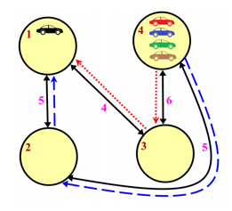

## 문제

You are in charge of designing an advanced centralized traffic management system for smart cars. The goal is to use global information to instruct morning commuters, who must drive downtown from the suburbs, how best to get to the city center while avoiding traffic jams.

Unfortunately, since commuters know the city and are selfish, you cannot simply tell them to travel routes that take longer than normal (otherwise they will just ignore your directions). You can only convince them to change to different routes that are equally fast.

The city’s network of roads consists of intersections that are connected by bidirectional roads of various travel times. Each commuter starts at some intersection, which may vary from commuter to commuter. All commuters end their journeys at the same place, which is downtown at intersection 1. If two commuters attempt to start travelling along the same road in the same direction at the same time, there will be congestion; you must avoid this. However, it is fine if two commuters pass through the same intersection simultaneously or if they take the same road starting at different times.

Determine the maximum number of commuters who can drive downtown without congestion, subject to all commuters starting their journeys at exactly the same time and without any of them taking a suboptimal route.

Figure C.1: Illustration of Sample Input.

In Figure C.1, cars are shown in their original locations. One car is already downtown. Of the cars at intersection 4, one can go along the dotted route through intersection 3, and another along the dashed route through intersection 2. But the remaining two cars cannot reach downtown while avoiding congestion. So a maximum of 3 cars can reach downtown with no congestion.

## 입력

The input consists of a single test case. The first line contains three integers n, m, and c, where n (1 ≤ n ≤ 25 000) is the number of intersections, m (0 ≤ m ≤ 50 000) is the number of roads, and c (0 ≤ c ≤ 1 000) is the number of commuters. Each of the next m lines contains three integers xi, yi, and ti describing one road, where xi and yi (1 ≤ xi, yi ≤ n) are the distinct intersections the road connects, and ti (1 ≤ ti ≤ 10 000) is the time it takes to travel along that road in either direction. You may assume that downtown is reachable from every intersection. The last line contains c integers listing the starting intersections of the commuters.

## 출력

Display the maximum number of commuters who can reach downtown without congestion.
