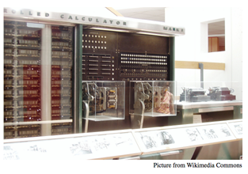

## 문제

The term “Harvard architecture” applies to a computer that has physically separate memories for instructions and data. The term originated with the Harvard Mark I computer, delivered by IBM in 1944, which used paper tape for instructions and relays for data.

Some modern microcontrollers use the Harvard architecture – but not paper tape and relays! Data memory is organized in banks, each containing the same number of data items. Each data-referencing instruction has a byte offset f to a bank, and a bit a that is used to select the bank to be referenced. If a is 0, then bank 0 is referenced. If a is 1, then the value in a bank select register (BSR) identifies the bank to be used. Assume each instruction takes the same time to execute, and there is an instruction that can set the BSR’s value.

For example, suppose there are 4 banks of 8 bytes each. To access location 5, either use a single instruction with a = 0 and f = 5, or set the BSR to 0 in one instruction and then use an instruction with a = 1 and f = 5. The first approach is faster since it does not require setting the BSR.

Now suppose (with the same memory) the location to access is 20. Only one approach will work here: execute an instruction that sets the BSR to 2 (unless the BSR already has the value 2) and then use an instruction with a = 1 and f = 4.

A program is a sequence of operations. Each operation is either

* a variable reference, written as Vi, where i is a positive integer, or
* a repetition, written as Rn <program> E, where n is a positive integer and <program> is an arbitrary program. This operation is equivalent to n sequential occurrences of <program>.

Your problem is to determine the minimum running time of programs. In particular, given the number and size of the memory banks and a program to be executed, find the minimum number of instructions (which reference memory location and possibly set the BSR) that must be executed to run the program. To do this you must identify a mapping of variables to memory banks that yields the smallest execution time, and report that execution time – that is, the number of memory references and BSR register settings required. The BSR’s value is initially undefined, and changes only when an instruction explicitly sets its value.

## 입력

The input consists of a single test case. A test case consists of two lines. The first line contains two integers b and s, where 1 ≤ b ≤ 13 is the number of memory banks and 1 ≤ s ≤ 13 is the number of variables that can be stored in each memory bank. The second line contains a non-empty program with at most 1 000 space-separated elements (each Rn, Vi, and E counts as one element).

You may assume the following:

* In a repetition Rn, the number of repetitions satisfies 1 ≤ n ≤ 106.
* In a loop operation Rn <program> E, the loop body <program> is not empty.
* In a variable reference Vi, the variable index satisfies 1 ≤ i ≤ min(b · s, 13).
* The total number of variable references performed by an execution of the program is at most 1012.

## 출력

Display the minimum number of instructions that must be executed to complete the program.
