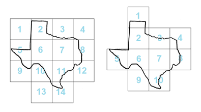

## 문제

지도를 만드는 일은 쉬운 일이 아니다. 지구는 구형이기 때문에, 2차원 평면에 나타낼 때 왜곡이 발생한다. 또, 고화질 지도는 매우 크기 때문에, 종이 한장에 인쇄할 수 없다. 따라서, 지도를 여러 부분으로 쪼갠 나눈 다음 종이 여러 개에 인쇄를 해 합친다.

상근이는 지도를 제작하고 있다. 상근이는 항상 이익만을 추구하기 때문에, 종이를 최대한 적게 사용해 지도를 인쇄하려고 한다. 종이의 크기는 모두 같다.

왼쪽 그림은 한 지도를 종이 14개에 인쇄한 것이고, 오른쪽 그림은 같은 지도를 종이 10개에 인쇄한 것이다. 두 지도 모두 같은 종이를 사용하며, 종이의 크기와 방향은 모두 같다.

지도가 주어졌을 때, 지도를 인쇄하는데 필요한 종이 개수의 최솟값을 구하는 프로그램을 작성하시오. 지도는 모두 닫힌 다각형이고, 교차하지 않는다.

종이는 모두 직사각형이고, x축과 y축에 평행해야 한다. 서로 접하는 종이의 꼭짓점은 일치해야 하고, 종이를 회전할 수는 없다. 입력으로 주어지는 모든 좌표는 정수이지만, 종이는 정수가 아닌 좌표에 놓을 수 있다.

지도는 종이의 외각선에 접해도 된다. 소수점 계산으로 생기는 오차를 피하기 위해, 지도가 종이의 바깥으로 10-6 까지 넘어가도 정답은 같다.

## 입력

첫째 줄에 지도의 꼭짓점의 수 n (3 ≤ n ≤ 50), 종이의 크기 xs, ys (1 ≤ xs, ys ≤ 100)이 주어진다.

다음 n개 줄에는 지도의 꼭짓점을 나타내는 두 정수 x와 y가 주어진다. (0 ≤ x ≤ 10xs, 0 ≤ y ≤ 10ys) 꼭짓점은 시계방향 또는 반시계방향으로 주어진다.

## 출력

첫째 줄에 지도를 인쇄하기 위해 필요한 종이 개수의 최솟값을 출력한다.
