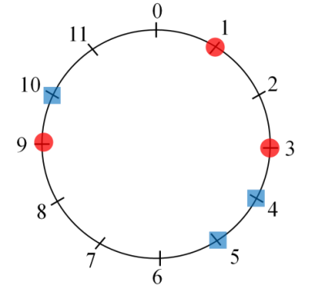

## 문제

A huge particle accelerator will be constructed in Daedeok Innopolis. The accelerator may be considered as a huge electric circuit, containing a lot of bridges. The bridges must be connected by wires. Particularly, there are red and blue bridges, and each red bridge must be connected by a wire to one of the blue bridges. The goal is to minimize the total length of wires connecting red bridges with blue ones.

More precisely, we have a circle representing the accelerator, and there are red and blue points on the circle representing the red bridges and the blue bridges. The number of red points is less than or equal to the number of blue points and all red and blue points are distinct. Each red point must be connected to a blue point with a wire. Two or more red points cannot be connected to the same blue point. The length of wire is the arc length between the connected points.So the goal is to minimize the sum of the arc lengths between matched points.

For convenience, we use a circle of perimeter , and consider only n locations on the circle such that the arc length between two adjacent locations is 1. The locations are numbered by 0, 1, …, n-1 clockwise. Each red or blue point is at one of these locations, that is, the location of a red or blue point is represented as one of the integer numbers 0, 1, …, n-1. The length between arbitrary pair of red and blue points is always an integer. For example, Figure 1 shows 3 red points and 3 blue points lying on a circle with 12 locations. In an optimal matching of this example, the red points at location 1, 3, and 9 are matched with the blue points at location 5, 4, and 10, respectively. So the minimum sum of arc lengths between the matched points is 6.

  
Figure 1.

Given red and blue points on a circle sorted clockwise, write a program to match the red points and the blue ones minimizing the sum of the arc lengths between matched points.

## 입력

Your program is to read from standard input. The input consists of T test cases. The number of test cases T is given in the first line of the input. Each test case starts with a line containing three integers, n, a and b (1 ≤ n ≤ 1, 000, 000, 1 ≤ a ≤ b ≤ 1, 000, 000, 2 ≤ a + b ≤ n), where n is the number of locations considered on the circle, a is the number of red points and b is the number of blue points. In the second line of each test case, a sorted integers x1, x2, . . . , xa are given, representing the locations of red points. In the third line of each test case, b sorted integers y1, y2, . . . , yb are given, representing the locations of blue points. Then 0 ≤ xi , yi ≤ n − 1, i = 1, . . . , a and j = 1, . . . , b, and all xi’s and yi’s are distinct. There is a single space between two integers in same line.

## 출력

Your program is to write to standard output. Print exactly one line for each test case. The line should contain the minimum of the sum of arc lengths between the matched red and blue points.
