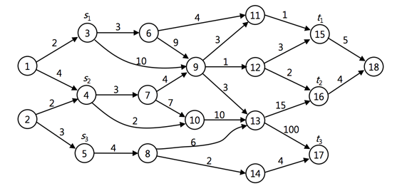

## 문제

The PERT (Project Evaluation and Review Technique) chart, a graphical tool used in the field of project management, is designed to analyze and represent the set of tasks involved in completing a given project. Edges in PERT chart represent tasks to be performed, and edge weights represent the length of time required to perform the task. For vertices u, v, w of a PERT chart, if edge (u,v) enters vertex v and edge (v,w) leaves v, then task (u,v) must be performed prior to task (v,w). A path through a PERT chart represents a sequence of tasks that must be performed in a particular order. Note that there is no cycle in the PERT chart. A critical path is a longest path in PERT chart, corresponding to the longest time to perform an ordered sequence of tasks. The weight of a critical path is a lower bound on the total time to perform all the tasks in a project.

A 3-path of six distinct vertices s1, s2, s3, t1, t2, t3 in a PERT chart is defined as follows:

1. A 3-path consists of three paths Pi from vertex si to vertex ti for i =1, 2, 3.
2. The paths P1, P2, P3 are vertex-disjoint, i.e., no two of the paths have vertices in common.

The length of a 3-path is the sum of the length of the 3 paths P1, P2, P3. A critical 3-path of six distinct vertices in a PERT chart is a 3-path of maximum length over all 3-paths.

For example, a critical 3-path {P1, P2, P3} of a graph in Figure 1, where P1 is a path from vertex 3 to vertex 15, P2 is a path from vertex 4 to vertex 16, and P3 is path from vertex 5 to vertex 17, is as follows:

* P1 : 3 → 6 → 11 → 15
* P2 : 4 → 7 → 9 → 12 → 16
* P3 : 5 → 8 → 13 → 17

The length of the critical 3-path is 128.

Figure 1. A sample PERT chart

Given a graph corresponding to a PERT chart and six distinct vertices, write a program to find the length of critical 3-path of the graph corresponding to the six vertices.

## 입력

Your program is to read from standard input. The input consists of T test cases. The number of test cases T is given in the first line of the input. Each test case starts with a line containing two integers, n and m (6 ≤ n ≤ 100, n-1 ≤ m ≤ n(n-1)/2), where n is the number of vertices and m is the number of edges. Every input node is numbered from 1 to n. Next line contains six integers s1, s2, s3, t1, t2, t3, where all six integers are distinct. In the following m lines, the weight of the directed edges are given; each line contains three integers, u, v, and W (1 ≤ W ≤ 100,000), where W is the weight of an edge from vertex u to v. You may assume that u < v.

## 출력

Your program is to write to standard output. Print exactly one line for each test case. The line should contain the length of critical 3-path {P1, P2, P3}, where Pi is a path from si to ti (1 ≤ i ≤ 3). If there does not exist a critical 3-path, print 0.
