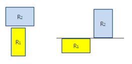
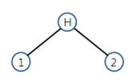
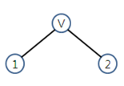
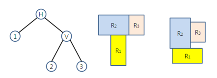
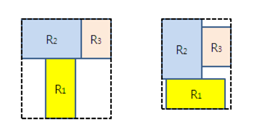

## 문제

VLSI circuits are too complex to design without CAD tools since the complexity of many VLSI circuits is in the order of millions of transistors today. In order to reduce the complexity of the design process for a VLSI circuit, the whole process is broken into several intermediate phases. Among them is a physical design phase. In the physical design phase, the basic components of the circuit are usually thought of as rectangular modules. The physical design phase itself consists of several steps. One of the steps, which is most crucial for the performance of the circuit, is a floorplan/placement step. Actual floorplan/placement problem in the VLSI circuit design is very complex. However, here, you are asked to deal with a simple version of the problem, in which each component of a VLSI circuit can be viewed as a rectangle in the plane.

A simple version of the floorplan/placement problem is to place n rectangles in the plane in axis-parallel orientation such that some given constraints are satisfied. Information about relative locations among rectangles is given as constraints. Relative location means that rectangle Ri (1 ≤ i ≤ n), should be placed either below (or above) rectangle Rj (1 ≤ j ≤ n), or to the left (or right) hand side of rectangle Rj. For each rectangle Ri, the coordinates of its lower left corner and its upper right corner are represented as (xill, yill) and (xiur, yiur), respectively. That rectangle Ri is located below rectangle Rj means yiur ≤ yjll. Similarly, that rectangle Ri is to the left of rectangle Rj means xiur ≤ xjll. Notice that each rectangle can be placed rotated by 90°. Figure 1 shows two example cases in which rectangle R1 is below rectangle R2.

Figure 1. Two example cases to illustrate R1 is below R2

The constraints regarding relative locations among the rectangles are represented as a binary tree called ‘slicing tree.’ A slicing tree represents how the plane is partitioned and which rectangle should be placed in each sub-region. Each internal node of the slicing tree is labeled as either Ⓗ or Ⓥ. Each external node of the slicing tree is labeled with a rectangle identification number i (1 ≤ i ≤ n). The label Ⓗ or Ⓥ for an internal node means that the sub-region on the plane is partitioned either by a horizontal line or by a vertical line. For example, if the slicing tree is as shown in Figure 2, it means that the plane is partitioned by a horizontal line and that rectangle R1 should be placed below rectangle R2. Notice that both of the placements shown in Figure 1 meet the constraint shown in Figure 2.

Figure 2. An example of slicing tree for 2 rectangles

On the other hand, if the slicing tree is as shown in Figure 3, it means that the plane is partitioned by a vertical line and that rectangle R1 should be placed to the left hand of rectangle R2.

Figure 3. Another example of slicing tree for 2 rectangles

If any internal node Nk in the slicing tree is labeled as Ⓗ, all the rectangles belonging to the left sub-tree rooted at Nk should be placed below any rectangles belonging to the right sub-tree rooted at Nk. Similarly, if any internal node Nk in the slicing tree is labeled as Ⓥ, all the rectangles belonging to the left sub-tree rooted at Nk should be placed to the left of any rectangle belonging to the right sub-tree rooted at Nk. For example, Figure 4 shows a slicing tree and two different corresponding placements.

Figure 4. A slicing tree and its two different corresponding placements

Let \(\boxed { R } \) denote the minimum rectangle which encloses all the rectangles when a placement is determined. Such enclosing rectangles corresponding to the placements shown in Figure 4 are shown in Figure 5 with dotted lines.

Figure 5. Minimum enclosing rectangles

Given information regarding a slicing tree and the rectangles’ dimensions, your program should determine the location for each rectangle such that the placement meets the given constraints and such that the area of the enclosing rectangle \(\boxed { R } \) is as small as possible. Notice that the area of the enclosing rectangle \(\boxed { R } \) can be affected by the orientation of each rectangle.

## 입력

Your program is to read from standard input. The input consists of T test cases. The number of test cases T is given in the first line of the input. Each test case starts with a line containing an integer n (1 ≤ n ≤ 1,000), where n is the number of rectangles. In the following n lines, dimensions of n rectangles are given, each line for each rectangle. The i–th (1 ≤ i ≤ n) line contains two integers, w and h (1 ≤ w,h ≤ 500), w for width and h for height of rectangle i. In the next line the information regarding a slicing tree is given. The information is represented as a list consisting of 2n - 1 items separated by spaces, which is obtained by traversing the slicing tree in post-order. Each item of the list is either a label for an internal node or for an external node. The label for an internal node is either H or V. The label for an external node is an integer i (1 ≤ i ≤ n), which is the rectangle identification number.

## 출력

Your program is to write to standard output. Print exactly one line for each test case. For each test case, find a placement such that the given constraints regarding relative locations among rectangles are satisfied and the area of the enclosing rectangle \(\boxed { R } \) is as small as possible. Then print the area of the rectangle \(\boxed { R } \)  for each test case. You can assume that the resulting area of \(\boxed { R } \) is less 1010 than for each test case.
