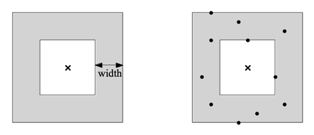

## 문제

A square annulus is the planar shape contained between two concentric axis-parallel squares, i.e., two squares with a common center whose sides are parallel to the x- and y-axes. More precisely, it means the area inside the bigger square but outside the smaller one, including their boundaries. The width of a square annulus is defined to be half the difference of the side lengths of its two squares. See the left figure below, in which a square annulus is depicted as gray region with the center marked by ×.

You are given N points in the plane and you have to find a square annulus A of minimum width that contains all the N given points. The right figure above shows an example of a square annulus of minimum width containing all given points (marked by dots).

Your program is to compute the width of a square annulus A that contains all the N given points. You can exploit the following fact, which has been shown by a German research group:

There exists a square annulus A of minimum width containing N given points such that its bigger square is a smallest axis-parallel square containing the N points.

Because the bigger square S of A must contain all the N points, the above fact means that S can be assumed to have the minimum side length among all axis-parallel squares containing the N points; in other words, if L is the side length of S, then there is no axis-parallel square containing the N points with side length smaller than L.

Remark that there can be many such squares of the same side length with S containing the given points. Also, note that the width of A can be zero when the two squares defining A are the same; or, the smaller square of A may have side length zero, so the width of A can be as large as half the side length of its bigger square.

## 입력

Your program is to read from standard input. The input consists of T test cases. The number T of test cases is given in the first line of the input. From the second line, each test case is given in order, consisting of the following: a test case contains an integer N (1 ≤ N ≤ 100,000), the number of input points, in its first line, and is followed by N lines each of which consists of two integers inclusively between -1,000,000 and 1,000,000, representing the x- and y-coordinates of a point in the plane. Two consecutive integers in one line are separated by a single space and there is no empty line between two consecutive test cases.

## 출력

Your program is to write to standard output. Print exactly one line for each test case. The line should contain a single value, representing the minimum width of an axis-parallel square annulus A containing the N input points. The value to be printed should consist of the whole integer part of the computed width, a decimal point, and exactly one digit after the decimal point. So, if necessary, you should round off the computed width to one decimal place.
