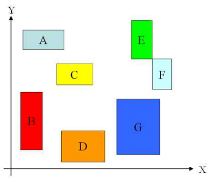
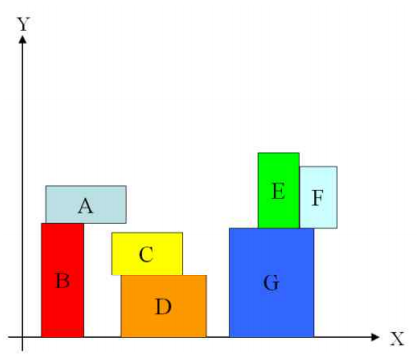
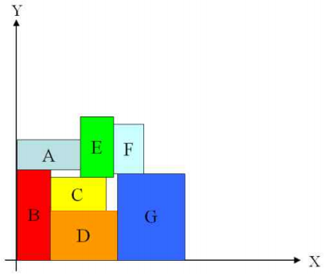

## 문제

We are given R, a set of rectangles, which are x,y-axis parallel and mutually disjoint, but can share boundaries. All rectangles should be placed in the quadrant x ≥ 0, y ≥ 0 of the plane. We are asked to compact these rectangles using the procedure COMPACT in the following. After this procedure, places of all rectangles are fixed. You are asked to find a smallest enclosing rectangle for them. The enclosing rectangle also must be x,y- axis parallel.

`Procedure: COMPACT`

```

do { 
     Step 1. Move blocks downward until no blocks can be moved. 
     Step 2. Move blocks leftward until no blocks can be moved. 
} Until no blocks can be moved downward or leftward.
```

Let us explain this compaction procedure in the following example. Figure 1 is the initial layout of the given set of rectangles. After moving blocks downward as much as possible, we get the layout as shown in Figure 2.



Figure 1. Input Rectangles



Figure 2. After moving blocks downward

Since we cannot move any blocks downward in Figure 2, we try to move blocks leftward by COMPACT in Figure 3. Note that all blocks must remain mutually disjoint in the COMPACT procedure, but they can be put together along boundary edges. For boundary edges sharing, see {E, G, F}, {A, B} and {C, D} rectangles in Figure 2.


Figure 3. After moving blocks leftward



Figure 4. After moving blocks downward

If we repeat this procedure as in Figure 4 until we cannot move any blocks, then we get the final compacted rectangles as shown in Figure 5. Finally we obtain the dotted rectangle as the smallest enclosing rectangle for them.


Figure 5. We finally get the smallest enclosing rectangle (dotted box) by applying COMPACT till no blocks can be moved.

Your task is to compute the final enclosing rectangle obtained from applying COMPACT.

## 입력

Your program is to read from standard input. The input consists of T test cases. The number of test cases T is given in the first line of the input. The first line of each test case contains N (1 ≤ N ≤ 500) , the number of rectangles given. Then N lines follow to define each rectangle with the integer coordinates of the lower-left vertex (x,y) and upper-right vertex (p,q) in a single line as x y p q, where x < p, y < q and 0 ≤ x,y,p,q ≤ 100,000.

## 출력

Your program is to write to standard output. Print exactly one line for each test case. The line should contain two numbers W and H, the width and height of the enclosing rectangle obtained by COMPACT.
