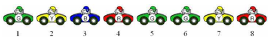
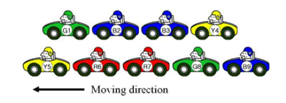
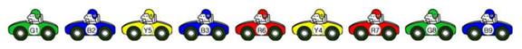
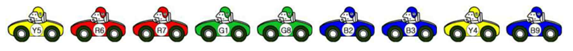

## 문제

자동차 여러 대가 그림 1과 같이 한 줄로 이동하고 있다. 각 자동차의 색상은 한 글자로 나타내며, 인접한 두 차 사이의 거리는 1이다. 그림 1에는 각 차의 위치도 적혀져 있다.

그림 1. 도로를 이동하는 여러 가지 색상의 자동차

각각의 색상 c에 대해서, location(c)는 색상 c로 색칠된 모든 차의 위치의 집합을 나타낸다. 색상의 길이 L(c)는 다음과 같이 정의한다.

\(L(c) = max \left\{location(c)\right\} - min \left\{location(c)\right\}\)

예를 들어, 그림 1에서 location(G) = {1,5,6}, location(Y) = {2,7}, location(B) = {3}, location(R) = {4,8}이 되고, 각 색상의 길이와 모든 길이의 합은 아래와 같다.

| 색상 | G | Y | B | R | 합계 |
| --- | --- | --- | --- | --- | --- |
| L(c) | 5 | 5 | 0 | 4 | 14 |

경주시의 거의 모든 도로는 적어도 500년 전에 건설되었다. 비가 온 이후에는 도로에 물 웅덩이가 많이 생기고, 여행객은 도로 상황이 좋지 않음을 오랜 기간 항의했다. 경주시는 문화재 보호에 더 집중하고 있기 때문에, 이번에 도로 하나만 수리를 하려고 한다. 이번에 고칠 도로는 4차선 도로이고, 각 방향으로 2차선 도로이다.

수리를 하는 도중에 도로를 완전히 통제하면, 시민들의 불편은 매우 심해지게 된다. 따라서, 각 방향으로 한 차선씩 먼저 통제하고 수리를 하려고 한다. 수리되는 구간에서 도로는 1차선으로 좁아지게 되고, 2차선으로 이동하던 자동차는 1차선으로 합쳐져야 한다.

예를 들어, 그림 2와 같이 두 차선이 그림 3과 같이 한 차선으로 합쳐지는 경우를 생각해보자. 같은 색 자동차를 구분하기 위해, 각 차에 숫자를 붙였다.

그림 2. 차선이 합쳐지기 전에 두 차선을 이동하는 자동차

그림 3은 한 차선으로 합쳐지는 두 시나리오를 나타낸다. 그림 3에서 볼 수 있듯이, 한 차선의 모든 차가 진입한 이후에 다른 차선의 차가 진입할 필요는 없다. 서로 번갈아가면서 한 차선으로 진입할 수 있다. 합쳐진 이후에도 자동차 사이의 거리는 1이다.

합쳐진 이후 (시나리오 1):

합쳐진 이후 (시나리오 2):

그림 3. 한 차선으로 합쳐진 이후의 도로 상황 (두 가지)

그림 3에 나온 각각의 시나리오에 대해서, 색상의 길이와 합을 구해보면 아래와 같다.

| 색상 | G | Y | B | R | 합계 |
| --- | --- | --- | --- | --- | --- |
| L(c): 시나리오 1 | 7 | 3 | 7 | 2 | 19 |
| L(c): 시나리오 2 | 1 | 7 | 3 | 1 | 12 |

그림 3에 나와있는 방법 말고도 차선을 합치는 방법은 여러 가지가 있다.

합쳐지기 전, 두 차선의 자동차 색상 정보가 주어진다. 이때, 색상의 길이의 합이 가장 최소가 되게 차선을 합치는 방법을 찾는 프로그램을 작성하시오.

## 입력

입력은 T개의 테스트 케이스로 이루어져 있다. 첫째 줄에 테스트 케이스의 수 T가 주어진다. 각 테스트 케이스는 두 줄로 이루어져 있다. 첫째 줄에는 한 차선의 자동차 색상 정보가 주어지며, 둘째 줄에는 다른 차선의 자동차 색상 정보가 주어진다. 각 색상은 알파벳 대문자로 나타낸다. 즉, 색상의 개수는 26개이다. 한 차선에 있는 자동차의 수는 1보다 크거나 같으며, 5,000을 넘지 않는다.

## 출력

각 테스트 케이스 마다, 한 차선으로 합쳐진 이후의 색상 길이의 합의 최솟값을 출력한다.
