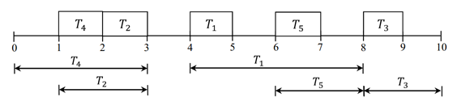
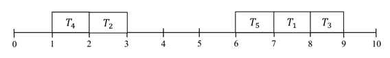

## 문제

랩탑(노트북)은 이동하면서 사용할 수 있는 개인용 컴퓨터이다. 노트북은 디스플레이, 키보드, CD-ROM 같은 데스크탑 컴퓨터의 전형적인 부품을 모두 포함하고 있다. 랩탑의 가장 큰 특징은 휴대성이다. 즉, 집이나 사무실 말고도 커피숍, 강의실, 도서관, 미팅룸과 같은 곳에서도 자유롭게 이용할 수 있다. 랩탑은 배터리를 사용한다. 보통 배터리를 2시간에서 5시간정도 사용할 수 있으며, 에너지를 많이 사용하는 경우에는 1시간으로 줄어들 수도 있다. 배터리의 성능은 사용 기간이 오래될수록 점점 떨어진다.

일정 시간동안 랩탑을 사용하지 않으면, 에너지 소비를 줄이기 위해 대기 모드나 절전 모드로 진입한다. 이러한 모드에 진입하게 되면, 에너지를 더 이상 소비하지 않는다. 하지만, 랩탑을 다시 활성화 시키려면 단위 시간동안 특정 양만큼의 에너지가 필요하다. 따라서 랩탑의 총 에너지 소비량을 줄이려면, 사용하지 않는 구간을 줄여야 한다.

각각의 작업 Ti는 릴리즈 타임 ri와 데드라인 di를 가지고 있다. Ti는 단위 시간만큼만 실행되며, 시간 구간 [ri,di]내에 스케줄되고 완료되어야 한다. 또한 작업들은 아래와 같은 조건을 만족한다.

1. ri와 di는 정수이고, Ti 는 정수 시간에 스케줄 되어야 한다.
2. ri ≤ rj일 필요충분조건은 di ≤ dj이다.
3. 모든 작업을 각각의 구간 내에 완료하는 스케줄이 적어도 하나 존재한다.

사용하지 않는 구간의 수를 최소화하면서 모든 작업을 스케줄하는 방법을 찾는 프로그램을 작성하시오. 사용하지 않는 구간은 첫 번째 작업을 스케줄한 이후부터 센다.

예를 들어, [r1,d1] = [4,8], [r2,d2] = [1,3], [r3,d3] = [8,10], [r4,d4] = [0,3], [r5,d5] = [6,8]과 같이 작업이 다섯 개 있는 경우를 생각해보자. 그림 1처럼 스케줄한 경우 사용하지 않는 구간의 수는 3개이다. 하지만, 그림 2와 같이 스케줄하면 사용하지 않는 구간은 1개이다.

그림 1. 사용하지 않는 구간이 3개인 스케줄

그림 2. 사용하지 않는 구간이 최소 개수인 스케줄

## 입력

첫째 줄에 테스트 케이스의 개수 T가 주어진다. 각 테스트 케이스의 첫째 줄에는 작업의 수 n(1 ≤ n ≤ 100,000)가 주어진다. 다음 n개 줄에는 작업 Ti의 릴리즈 시간 ri와 데드라인 di가 주어진다. (0 ≤ ri ≤ di ≤ 1,000,000)

## 출력

각 테스트 케이스 마다 사용하지 않는 구간의 최소 개수를 출력한다.
