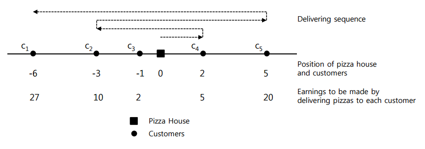

## 문제

There is a pizza house located on a straight road, and there are many houses along the road which are customers to the pizza house. To attract more orders from his customers, the owner of the pizza house advertised that he will deduct a penalty for late delivery from the price of the delivered pizzas. The penalty is to be charged when some designated time period has passed after the order has been made, and the amount of penalty to be charged is 1 Korean Won per unit time thereafter. Today all houses on the road ordered pizza at the same time and the delivery of all the ordered pizzas has just started when the late delivery penalty is going to be charged. On a busy day like today, he may not deliver pizza to some customers if the late delivery penalty to be deducted for a customer is more than the earning to be made by selling pizza to the customer. Write a program to help him decide to which customers he has to deliver pizzas and which customers he may skip in order to make the greatest profit. Note that the profit made by delivering a pizza to a customer is the amount of earning from the service deducting the penalty for late delivery. You may assume that his moving velocity is one unit distance per unit time and it takes no time to hand over the pizza to the customer.

For example, the following figure shows the relative positions of five customers {c1, c2, , c5} to the pizza house and the earning to be made by selling pizzas to each customer.

If the delivering sequence of customers is <c4, c3, c2, c5, c1>, then the amount of penalty for late delivery to each customer is 2 for c4, 5 for c3, 7 for c2, 15 for c5 and 26 for c1. In this case the profit from each customer is 3 for c4, -3 for c3, 3 for c2, 5 for c5 and 1 for c1. Since the profit from customer c3 is -3, it is better not to deliver pizza to c3. Therefore the total profit by delivering pizzas to the customers in this order is 12. The best profit the owner can make, in this case, is 32, where the delivering sequence is <c3, c2, c1, c5>.

Given the relative positions of customers to pizza house, and earnings to be made by delivering pizzas to each customer, write a program to compute the maximum profits by delivering pizzas ordered from the customers.

## 입력

Your program is to read from standard input. The input consists of T test cases. The number of test cases T is given in the first line of the input. Each test case consists of three lines. The first line of each test case contains an integer, n (1 ≤ n ≤ 100), which is the number of customers to pizza house. The second line of each test case contains n integers p1, p2, ..., pn ( p1 < p2 < ...< pn and pi ≠ 0, i =1, ..., n), where pi is the relative position of the i-th customer ci to the pizza house on the straight road. The third line of each test case contains n integers e1, e2, ... , en ( ei > 0, i =1, ..., n), where ei is the earning to be made by delivering pizzas to the customer ci. All integers in the second and third lines are between -100,000 and 100,000 both inclusive.

## 출력

Your program is to write to standard output. Print exactly one line for each test case. The line should contain the maximum profit by delivering pizzas ordered from the customers.
