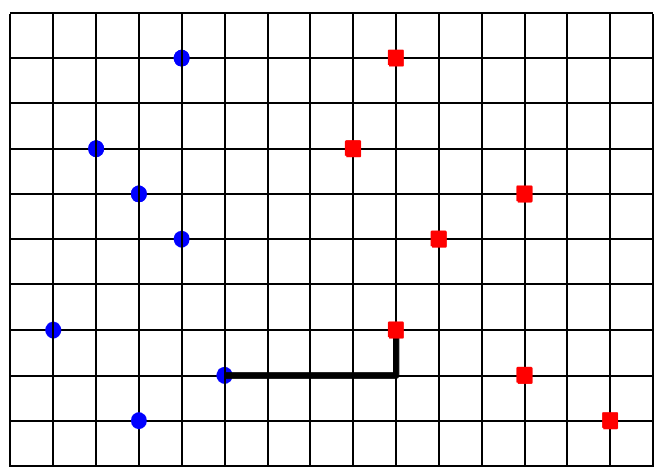

## 문제

Two rival companies, named IC and PC, share the Soju market in Korea. Soju is well-known Korean distilled liquor, going well with Korean cuisine. Currently they have an agreement on the location of their selling branches; the branches of IC should be located in the west of those of PC, that is, all the IC branches have smaller x-coordinates than any PC branch. At the beginning of every month, they observe any change in the location condition of the agreement. For this, they want to compute the distance of the closest pair of two branches, one from each company. The distance of two points (x1, y1) and (x2, y2) is defined as |x1-x2| + |y1-y2|.

  
Figure 1. Blue disks are the IC branches and red squares are the PC branches. The distance of a closest pair between them is 5.

You are given two sets of points, I and P, which represent branches of IC and PC companies, respectively. All points in I have smaller x-coordinates than any point in P. You write a program to compute the minimum distance of pairs (i, p) for i ∈ I and p ∈ P.

## 입력

Your program is to read from standard input. The input consists of T test cases. T is given in the first line of the input. The first line of each test case contains an integer n, the number of points of I, 1 ≤ n ≤ 100, 000. Each of the following n lines contains two integers, the x-coordinate and y-coordinate of each point of I. The next line contains an integer m, the number of points of P, 1 ≤ m ≤ 100, 000. Each of the next m lines contains two integers, the x-coordinate and y-coordinate of each point of P. Coordinates of the points are between −106 and 106 inclusive. Note that all points of I have smaller x-coordinates than any point of P.

## 출력

Your program is to write to standard output. Print exactly one line for each test case. The line should contain an integer value, the distance of a closest pair of points from I and P.
