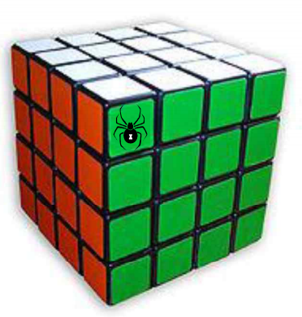

## 문제

“Traveling Spiders” is a logical puzzle that needs a sequence of systematic choices among many alternatives. The puzzle assumes a geometric object whose surface is partitioned into a set of areas called cells that are usually congruent, or very similar in their shapes and sizes. A spider may move around freely on the surface of the object, but, can move forward from a cell to only one of its neighboring cells in each step. Now, given some pairs of male and female spiders, initially positioned all in different cells, we want to find a set of paths that, respectively, leads each male spider to his partner. The only condition is that every cell of the object must be visited once and only once by a male spider during their traversal.

The “Traveling Spiders Puzzle (TSP for short) on Rubik’s Cube” problem considers a Rubik’s cube, each of whose six faces is partitioned into n × n square cells (the above figure exemplifies the case of n = 4). Here, two square cells are regarded as a neighbor to each other if and only if they share a side. So, there are four neighbors of a cell, each to east, west, south, and north. Furthermore, we assume that the cube is floating in the air so that all six faces can be traversed by a spider. Note that this puzzle problem is still in its early stage. On the other hand, you are now to write a program to solve a simple single-pair-of-spiders case: given a pair of male and female spiders put in different cells, find a path that passes every cell of the cube exactly once from the male spider to the female spider.

## 입력

Your program is to read from standard input. The input specifies T test cases. Hence, the value T naturally comes in the first line of the input, followed by a set of three lines, describing each test case. The first line of a test case specifies an even number n, representing the resolution of the cell grid, where we assume that 2 ≤ n ≤ 50. The second and third lines indicate the positions of the male and the female spiders, respectively. The locational data of a spider is encoded as coordinates in 3D space under the following rule: a corner or vertex of the cube is regarded as the origin and the directions of the three edges of the cube incident to the origin define those of the positive x, y, and z-axes, forming a right-handed 3D coordinate system. The side of each cell is of length two, implying that the cube exists in the space [0, 2n] × [0, 2n] × [0, 2n]. Then, the cell that a spider visits is specified as the x, y and z-coordinates of its center location.

## 출력

Your program is to write to standard output. For each test case, the first line of the results must contain an integer indicating whether there exists a feasible solution. If yes, the integer must be ‘1’; otherwise ‘-1’. If the first line is ‘1’, then it must be followed by 6n2 lines, describing the sequence of cells that the male spider visits on his way to his partner, including the first and last ones. In case multiple solutions are possible, just output any one of them.
