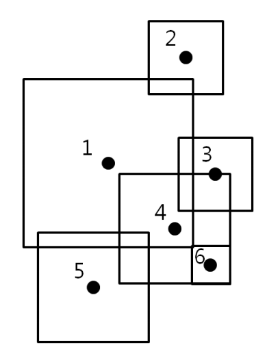

## 문제

There are N mines in an old battlefield. Each mine affects an axis-parallel square area depending on its performance. Assume that the location of the mine is the center of the square area. When a mine explodes, all mines in the square area of the explosion will explode as well. As a chain reaction, all the mines in the square area of the following explosion will also explode.

Assume that when a mine is exploding, a mine on the edge of the exploding square area will also explode. In the following figure, if mine 4 initiates, mines 3 and 6 will explode. If mine 1 initiates, mine 4 will explode. The following explosion will result mines 3 and 6 to explode. Therefore, initiating mines 1, 2, and 5 will cause all the mines to explode.

Given N mines with their explosion performance as square areas in a two-dimensional plane, write a program that determines the minimum number of mines that needs to be initiated to explode all given mines.

## 입력

Your program is to read the input from standard input. The input consists of T test cases. The number of test cases T is given in the first line of the input. Each test case starts with a line containing an integer N (3 ≤ N ≤ 2,000), which represents the number of mines. In the following N lines, each line contains three integers x, y and d, where x and y are the coordinates of the mine in the plane and d is the size of one side of the square which representing the explosion performance (1 ≤ x,y ≤ 10,000,000, 1 ≤ d ≤ 1,000,000)

## 출력

Your program is to write to standard output. Print exactly one line for each test case. Print the minimum number of mines that needs to be initiated to explode all given mines.
