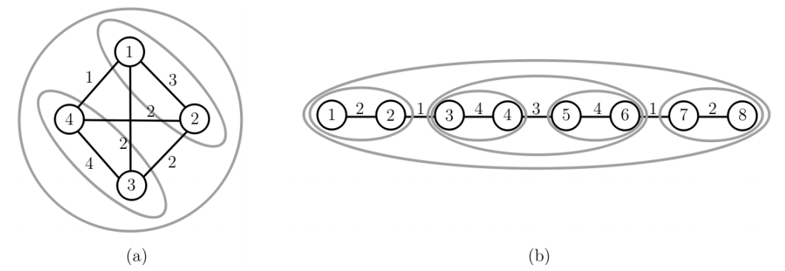

## 문제

Korea has many tourist attractions. One of them is an archipelago (Dadohae in Korean), a cluster of small islands scattered in the southern and western coasts of Korea. The Korea Tourism Organization (KTO) plans to promote a new tour program on these islands. For this, The KTO wants to designate two or more islands of the archipelago as a tour belt.

There are n islands in the archipelago. The KTO focuses on the synergy effect created when some islands are selected for a tour belt. Synergy effects are assigned to several pairs of islands. A synergy effect SE(u, v) or SE(v, u) between two islands u and v is a positive integer which represents a value anticipated when both u and v are included in a tour belt. The KTO wants to select two or more islands for the tour belt so that the economic benefit of the tour belt is as high as possible.

To be precise, we define a connected graph G = (V, E), where V is a set of n vertices and E is a set of m edges. Each vertex of V represents an island in the archipelago, and an edge (u, v) of E exists if a synergy effect SE(u, v) is defined between two distinct vertices (islands) u and v of V . Let A be a subset consisting of at least two vertices in V . An edge (u, v) is an inside edge of A if both u and v are in A. An edge (u, v) is a border edge of A if one of u and v is in A and the other is not in A.

A vertex set B of a connected subgraph of G with 2 ≤ |B| ≤ n is called a candidate for the tour belt if the synergy effect of every inside edge of B is larger than the synergy effect of any border edge of B. A candiate will be chosen as the final tour belt by the KTO. There can be many possible candidates in G. Note that V itself is a candidate because there are no border edges. The graph in Figure 1(a) has three candidates {1,2}, {3,4} and {1,2,3,4}, but {2,3,4} is not a candidate because there are inside edges whose synergy effects are not larger than those of some border edges. The graph in Figure 1(b) contains six candidates, {1,2}, {3,4}, {5,6}, {7,8}, {3,4,5,6} and {1,2,3,4,5,6,7,8}. But {1,2,7,8} is not a candidate because it does not form a connected subgraph of G, i.e., there are no edges connecting {1,2} and {7,8}.

  
Figure 1. Graphs and their good subsets marked by gray ellipses.

The KTO will decide one candidate in G as the final tour belt. For this, the KTO asks you to find all candidates in G. You write a program to print the sum of the sizes of all candidates in a given graph G. For example, the graph in Figure 1(a) contains three candidates and the sum of their sizes is 2 + 2 + 4 = 8, and the graph in Figure 1(b) contains six candidates and the sum of their sizes is 2 + 2 + 2 + 2 + 4 + 8 = 20.

## 입력

Your program is to read input from standard input. The input consists of T test cases. The number of test cases T is given in the first line of the input. Each test case starts with a line containing two integers n (2 ≤ n ≤ 5, 000) and m (1 ≤ m ≤ n(n−1)/2 ), where n represents the number of vertices (islands) and m represents the number of edges of a connected graph G. Islands are numbered from 1 to n. In the following m lines, the synergy effects assigned to m edges are given; each line contains three integers, u, v, and k (1 ≤ u ≠ v ≤ n, 1 ≤ k ≤ 105 ), where k is the synergy effect between two distinct islands u and v, i.e., SE(u, v) = SE(u, v) = k.

## 출력

Your program is to write to standard output. Print exactly one line for each test case. Print the sum of the sizes of all candidates for a test case.
