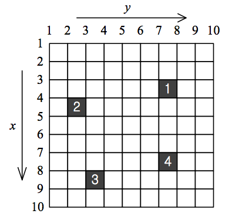
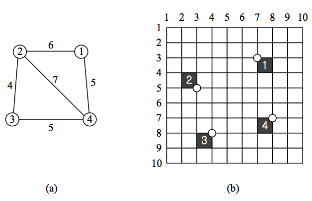

## 문제

Believe it or not, the streets of ACM city are laid out in an exact grid pattern, as shown in Figure 1. Each crossing in the streets is indentified with its vertical and horizontal street number. Some buildings in this city are so important that they need to be under surveillance by the police at all time. Since each building occupies an entire block of the streets, we can simply think of it as a cell of the grid. For an example, the black cells in Figure 1 represent important buildings. The building numbered 1 is located at a block surrounded by four crossings (3, 7), (3, 8), (4, 7) and (4, 8).

The APD (ACM Police Department) decided to assign one police officer to each of the important buildings and let them keep watch of the buildings. The police officer must reside at one of the four crossings surrounding the building he is in charge of. For an example, the officer in charge of building 1 in Figure 1 has to reside at one of the four crossings (3, 7), (3, 8), (4, 7), and (4, 8).

The officers should be able to communicate with each other. Since the chief of police was a huge fan of toys, he got rid of all walkie-talkies in the department, and instead forced the officers to use “string phones”. As you may know, a string phone is made of two paper cups (or, sometimes, two steel cans) linked by a string. For a string phone to work properly, the string should be kept tight. Since strings cannot pass though the buildings, they always run along the streets. Therefore, for two officers located at crossings (x1, y1) and (x2, y2), respectively, to be able to communicate, the length of the string phone they share must be equal to |x1 -x2| + |y1- y2|, which is called the shortest distance along the streets between the two crossings.

Figure 1. Streets of ACM city and locations of important buildings

Now, you have to help the officers to find their locations so that every string phone they have works properly. You are given the locations of n important buildings which are numbered from 1 through n. The buildings are apart from each other enough for no two buildings to have a crossing surrounding them in common. You are also given information about which couples of the officers share string phones and what the lengths of the strings are. This information is given as a form of weighted connected graph as depicted in Figure 2(a). Node i, i=1, 2, …, n, of the graph represents the officer who is in charge of building i. The existence of an edge (i, j) implies that two officers in charge of buildings i and j, respectively, share a string phone, and the weight of the edge represents the length of the string phone. This graph is always a connected graph. Your goal is to determine if it is possible to locate n officers so that every string phone works properly. Figure 2(b) shows an example of such locations for our example. In Figure 2(b), the small circles denote the crossings at which the officers are located. You can easily verify that the shortest distances along the streets between them are all met by the lengths of the string phones they have.

Figure 2. Lengths of string phones and proper locations of officers

## 입력

Your program is to read from standard input. The input consists of T test cases. The number of test cases T is given in the first line of the input. The first line of each test case contains one integer n, which is the number of important buildings, where 1 ≤ n ≤ 3,000. In the following n lines, each line contains two integers x, and y which mean, assuming that it is the i-th line among those n lines, that building i is located so that it is surrounded by the four street crossings (x, y), (x+1, y), (x, y+1), and (x+1, y+1), where 1 ≤ x, y ≤ 3,000,000. The next line contains another integer m which is the number of edges of the graph, where 1 ≤ m ≤ 300,000. In the following m lines, each line contains three integers u, v, and d which represent that there is an edge between vertex u and v of which the weight is d, where 1 ≤ d ≤ 6,000,000.

## 출력

Your program is to write to standard output. Print exactly one line for each test case. The output for each test case should be either possible or impossible depending on whether it is possible to place all officers satisfying given conditions or not.
