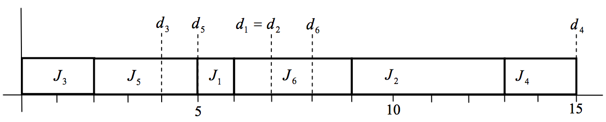

## 문제

In the morning, service engineers in a telecom company receive a list of jobs which they must serve today. They install telephones, internet, ipTVs, etc and repair troubles with established facilities. A client requires a deadline when the requested job must be completed. But the engineers may not complete some jobs within their deadlines because of job overload. For each job, we consider, as a penalty of the engineer, the difference between the deadline and the completion time. It measures how long the job proceeds after its deadline. The problem is to find a schedule minimizing the sum of the penalties of the jobs with the two largest penalties.

A service engineer gets a list of jobs Ji with a serving time si and a deadline di . A job Ji needs time si , and if it is completed at time Ci , then the penalty of Ji is defined to be max{0, Ci - di} . For convenience, we assume that the time t when a job can be served is 0 ≤ t < ∞ and si and di are given positive integers such that 0 < si ≤ di . The goal is to find a schedule of jobs minimizing the sum of the penalties of the jobs with the two largest penalties.

For example, there are six jobs Ji with the pair (si, di) of the serving time si and the deadline di , i =1,...,6 , where (s1 , d1) = (1, 7), (s2 , d2) = (4, 7), (s3 , d3) = (2, 4), (s4 , d4) = (2, 15), (s5 , d5) = (3, 5), (s6 , d6) = (3, 8). Then Figure 1 represents a schedule which minimizes the sum of the penalties of the jobs with the two largest penalties. The sum of the two largest penalties of an optimal schedule is that of the penalties of J2 and J6 , namely 6 and 1, respectively, which is equal to 7 in this example.

  
Figure 1. The optimal schedule of the example

## 입력

Your program is to read from standard input. The input consists of T test cases. The number of test cases T is given on the first line of the input. The first line of each test case contains an integer n (1 ≤ n ≤ 500) , the number of the given jobs. In the next n lines of each test case, the i -th line contains two integer numbers si and di, representing the serving time and the deadline of the job Ji, respectively, where 1 ≤ si ≤ di ≤10,000 .

## 출력

Your program is to write to standard output. Print exactly one line for each test case. The line contains the sum of the penalties of the jobs with the two largest penalties.
