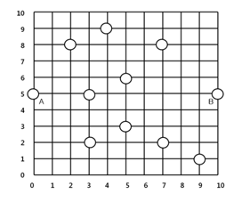

## 문제

상근이는 음식점을 개업하려고 한다. 상근이가 살고있는 도시는 크기가 M×M인 격자로 나타낼 수 있다. 따라서, 모든 도로는 수직 또는 수평이고, 각 도로는 0번부터 M-1번까지 번호가 매겨져 있다. 모든 음식점은 수익을 높이기 위해서 교차로에 있다.

도시에는 큰 아파트가 두 개 있고, 두 아파트는 같은 수평 도로 위에 있다. 아래 그림은 도시의 크기가 11×11이며, 동그라미는 현재 있는 음식점, A 또는 B가 쓰여 있는 곳은 아파트를 나타낸다. 아파트에는 이미 레스토랑이 있다. 교차로는 수직 도로와 수평 도로의 쌍을 이용해 좌표로 나타낸다. 두 교차로 (x1, y1)과 (x2, y2)사이의 거리는 |x1-x2| + |y1-y2|이다. 아래 그림에서 A와 B의 좌표는 각각 (0, 5), (10, 5)이다.

상근이는 두 아파트에 사는 사람이 서로 자주 만난다는 것을 알고 있다. 따라서, 새 음식점을 두 아파트의 중간에 만들려고 한다. 하지만, 이미 있는 음식점과 임대비를 생각해보니 무조건 중간에 만든다고 이익이 가장 높은 것은 아니라는 생각이 들었다. 따라서, 아래 조건을 만족하는 "좋은 곳"을 찾으려고 한다. dist(p,q)는 p와 q 사이의 거리이다.

> p가 "좋은 곳"이 되려면, 각각의 이미 있는 음식점 q에 대해서, dist(p,A) < dist(q,A) 또는 dist(p,B) < dist(q,B)를 만족해야 한다. 즉, dist(p,A) ≥ dist(q,A) 와 dist(p,B) ≥ dist(q,B)를 만족하는 음식점 q가 있는 경우에 p는 "좋은 곳"이 아니다.

위의 그림에서 (7,4)는 "좋은 곳"이다. 하지만, p=(4,6)은 q=(3,5) 때문에 좋은 곳이 아니다. (dist(p,A) = 5 ≥ dist(q,A) = 3, dist(p,B) = 7 ≥ dist(q,B) = 7) (0,0)도 (0,5) 때문에 좋은 곳이 아니다.

음식점의 위치가 주어졌을 때, "좋은 곳"의 개수를 구하는 프로그램을 작성하시오.

## 입력

첫째 줄에 테스트 케이스의 개수 T가 주어진다. 각 테스트 케이스의 첫째 줄에는 도시의 크기 M과 음식점의 수 N이 주어진다. (2 ≤ M ≤ 60,000, 2 ≤ n ≤ 50,000) 다음 줄에는 음식점의 좌표 xi, yi (0 ≤ xi, yi < M)가 주어진다. 두 음식점의 좌표가 같은 경우는 없고, 아파트 A는 첫 번째 음식점, 아파트 B는 두 번째 음식점이 있는 곳에 있다. 또, A와 B는 같은 수평 도로 위에 있다.

## 출력

각 테스트 케이스마다 "좋은 곳"의 개수를 출력한다.
