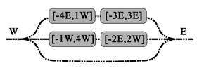
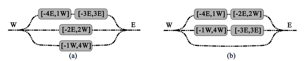

## 문제

KTX(Korea Train eXpress)는 KORAIL이 운영하는 대한민국 고속철도이며, 서울과 주요 도시를 연결한다. KTX-산천은 대한민국의 독자적인 기술로 개발된 열차로 350km/h까지 속도를 높일 수 있다. 현재 속도를 최고 400km/h까지 올릴 수 있는 다음 열차를 연구 개발중이다.

고양차량사업소는 한국에서 가장 큰 차량기지로, KTX 열차의 입출고 관리와 검수를 담당한다.

고양차량사업소에서 출발한 열차는 자정 전에 기지로 돌아오며, 아침에 떠나게 된다. 열차는 기지의 동쪽이나 서쪽으로 들어오며, 나갈때도 동쪽이나 서쪽을 이용한다. 각 차량이 들어오는 곳이나 나가는 곳은 모두 정해져 있다. 또, 출발시간과 도착시간도 모두 정해져 있다. 즉 각 열차가 기지 내에 있는 시간 구간 [t1, t2]와, 나가고 들어오는 방향 d1, d2를 이용해 나타낼 수 있다. [-6E, 13W]는 시간 -6에 동쪽으로 기지에 들어오고, 시간 13에 서쪽으로 기지를 나가는 열차라는 뜻이다. 그 시간에는 기지 내의 평행 선로에서 대기하고 있는다.

두 열차가 동시에 같은 방향으로 기지를 떠나거나 들어오는 것은 불가능하다. 모든 열차에는 다른 열차에 방해받지 않고 출발할 수 있도록 선로가 할당된다. 아 그림 1은 열차[-2E,2W]가 열차 [-1W,4W]에 의해 막혀있기 때문에 불가능한 경우이다. 그림 2(a)와 2(b)는 모두 가능한 경우이다. 2(b)는 선로를 최소 개수로 사용한다.

그림 1. 불가능한 선로 할당

그림 2. 가능한 선로 할당

KORAIL 연구소장 Dr. 좌는 고양차량사업소에서 보관하는 열차의 수를 늘리려고 한다. Dr. 좌는 선로의 개수가 고정되어 있기 때문에, 차량을 보관하는 일이 매우 어려워 질 것이라고 예견했다. 선로의 길이는 모든 열차를 보관할 수 있을 정도로 매우 길다. Dr. 좌는 모든 열차가 다른 열차에 막히지 않고 정시에 출발하고 도착할 수 있게 하기 위해 필요한 선로의 최소 개수를 구하려고 한다. Dr. 좌를 도울 수 있는 프로그램을 작성하시오.

## 입력

첫째 줄에 테스트 케이스의 개수 T가 주어진다. 각 테스트 케이스의 첫째 줄에는 열차의 수 n (1 ≤ n ≤ 10000)이 주어진다. 다음 n개 줄에는 열차를 나타내는 t1d1t2d2가 주어진다. t1과 t2는 정수이고 -1,000,000 ≤ t1 < 0 < t2 ≤ 1,000,000, d1,d2 ∈ {E, W} 를 만족한다.

## 출력

첫째 줄에 필요한 선로 개수의 최솟값을 출력한다.
