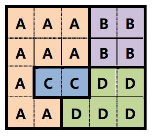

## 문제

In “The Lord of the Rings II,” when Prodo and the rest of the Fellowship of the Ring defeated the wizard of darkness, Saruman, he barely escaped death. Saruman gathered soldiers to attack the human countries again. Middle Earth was divided into two camps, a Saruman camp and a human camp. All the countries in the human camp made an alliance to protect their countries from Saruman. They agreed to help each other as follows:

1. The physically adjacent human countries make an alliance with each other.
2. Each human country Ci must dispatch fi /(ai+1) soldiers (ai denotes the number of adjacent countries to Ci , and fi denotes the number of own forces of Ci) to an adjacent country Cj whenever Cj is attacked. Note that the number of support forces is determined before the first war occurs, and it is never changed unless Ci and/or Cj are ruined.
3. If a human country is attacked by Saruman, it will fight against Saruman with all own forces and the support forces.

Saruman was pleased to hear the news from a spy crow. He thought that he could ruin the human camp, because he needed not to fight with all the human countries simultaneously.

The lands of the human countries form a rectangle, and the rectangle is partitioned into several grids. The following figure shows an example for the human land. The land consists of 4×5 grids, and there are A~D human countries. Each human country is one area which consists of consecutive grids. The countries A and C in the figure are adjacent each other as they share one or more grid boundaries, but B and C aren't adjacent each other. Note that, Saruman can attack directly the country which is in the middle of the land such as country C.

Saruman attacks only one country at once and uses all of his soldiers. In a war, the country that has more soldiers wins. If numbers of their soldiers are the same, the human country wins. All soldiers of a defeated country (including support forces) die, and any of a winner doesn't.

In the above example, when the numbers of soldiers of own forces of A, B, C and D are 160, 300, 60 and 80 respectively, Saruman can't win if he has 200 soldiers. However, if he has 210 soldiers, he can win by ruining the human countries C, D, A and B in turn.

Given the lands of the human countries and the numbers of soldiers of each human country and Saruman, determine which camp wins and dominates Middle Earth.

## 입력

Your program is to read from standard input. The input consists of T test cases. The number of test cases T is given in the first line of the input. Each test case consists of four parts. The first part is a line which contains the size of the human land, m and n (1 ≤ m, n ≤ 30) where m and n are the numbers of rows and columns of the land respectively. The second part consists of m lines. Each line contains a string whose length is n. The string consists of the names of the countries,'A'~'Z'. If the number of countries is c, then their names are the first c capital alphabets. For example, when the number of countries is 3, their names are 'A', 'B' and 'C '. The third part is a line which contains the numbers of soldiers of the human countries' own forces. The numbers are ordered by the alphabetical order of the countries' names. The number of integers in the third part is the same with the number of countries contained in the second part. The last part is a line which contains the number of Saruman's soldiers. Each number of soldiers is between 0 and 100,000 exclusive.

## 출력

Your program is to write to standard output. Print exactly one line for each test case. Each line should contain the winner, Human or Saruman.

The following shows sample input and output for two test cases.
