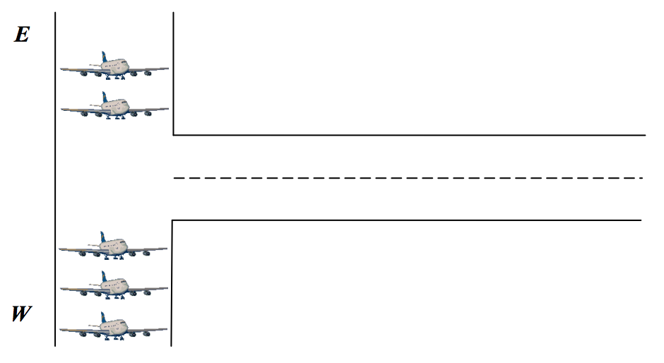
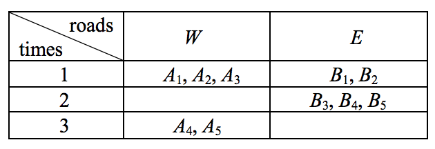

## 문제

A big city has an international airport handling 40 million passengers a year. But this is notorious as one of the most congested airports in the world. In this airport, there is only one landing strip as in the above figure. Therefore the landing strip is always crowded with a lot of aircrafts waiting for a takeoff. There are two ways, say west-road W and east-road E, to approach the landing strip. The aircrafts are waiting for a takeoff on the two roads as in the above figure.

At each time t, an arbitrary number of aircrafts arrive on the roads W and E. Each aircraft arriving on W or E at time t receives a rank, which is equal to the number of the waiting aircrafts on the same road to precede it. Then the one of W and E is chosen by a control tower, and the most front aircraft on the road leaves the ground. Given an information of the arriving aircrafts at times, we are concerned in the takeoff schedule of the control tower to minimize the maximum rank of the aircrafts.

For example, the above table represents the aircrafts arriving on the roads W and E at each time. At time 1, the aircrafts A1, A2 and A3 receive the ranks 0, 1 and 2, respectively, and the aircrafts B1 and B2 receive the ranks 0 and 1, respectively. Then the control tower allows the aircraft B1 on the road E to take off, and B1 leaves the ground. At time 2, the aircrafts B3, B4, and B5 receive the ranks 1, 2 and 3, respectively. Then A1 on the road W is allowed to take off, and it leaves the ground. At time 3, the aircrafts A4 and A5 receive the ranks 2 and 3, respectively. So the maximum rank of the aircrafts is 3, and this is the minimum of the maximum rank over all the possible takeoff schedules.

## 입력

Your program is to read from standard input. The input consists of T test cases. The number of test cases T is given on the first line of the input. The first line of each test case contains an integer n(1 ≤ n ≤ 5000) , the number of times. In the next n lines of each test case, the i-th line contains two integer numbers ai and bi , representing the number of arriving aircrafts on the road W and E, respectively, at time i , where 0 ≤ ai, bi ≤ 20 .

## 출력

Your program is to write to standard output. Print exactly one line for each test case. The line contains the minimum of the maximum rank over all the possible takeoff schedules.
